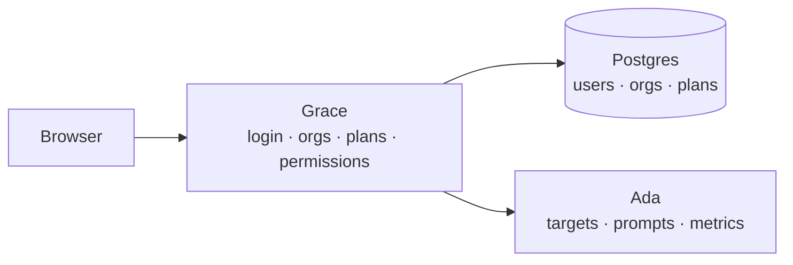
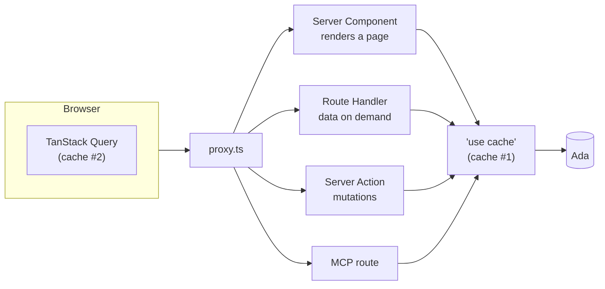
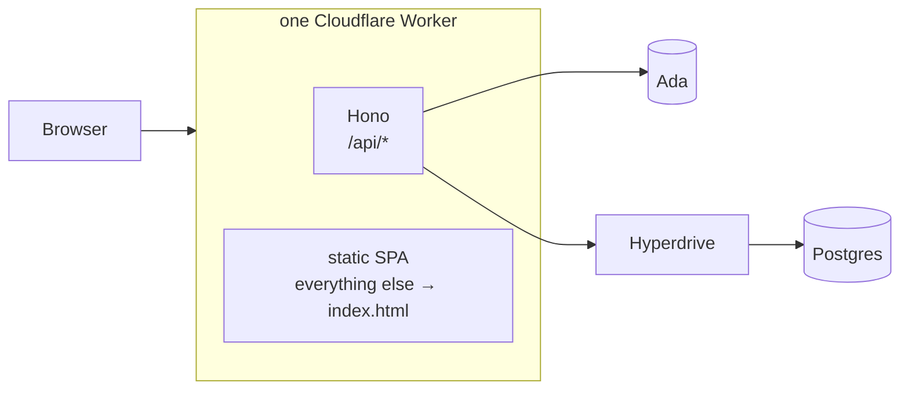
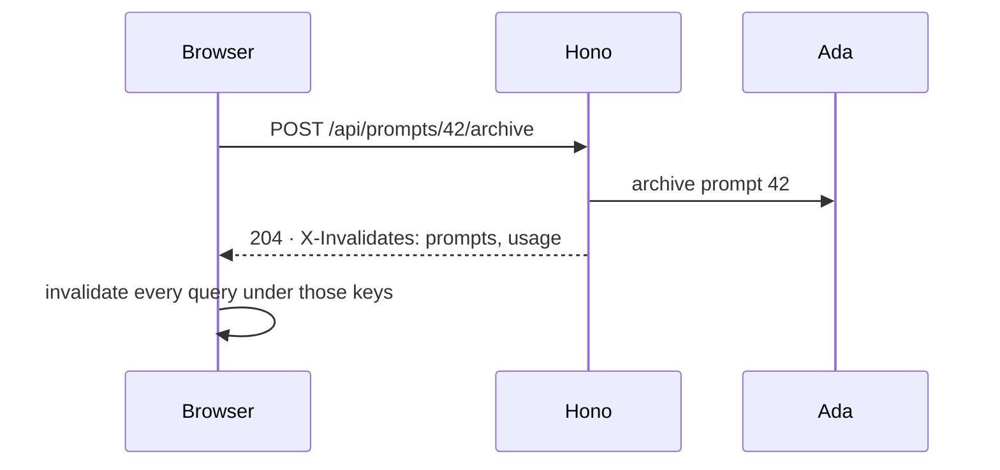

# Leaving Next.js for a SPA and a Worker

We moved the app Ranqia's customers log into off Next.js. It is now a React Router SPA and a Hono API, both on one Cloudflare Worker. This post
covers why we did it, how we rewrote the thing while the old one kept shipping
features, and what we tripped over on the way.

<!-- more -->

## Meet the cast

The rest of this post will only make sense if you know who's who, so here is the
cast list first.

[Ranqia](https://ranqia.ai) is a GEO platform. It watches how brands show up in
answers from ChatGPT, Gemini, Perplexity and friends: who gets mentioned, in
what position, how favourably, and which sources the model cited to say so.

**Ada** (`ada-api`) is the engine. It's a Python service that owns targets
(the brands being watched), prompts (the questions we keep asking the models)
and every metric computed from the answers. Ada started life as a PDF factory,
with reportlab and jinja2 turning templates into performance reports on a queue,
dropping them on S3, and handing back a download link. It has grown a lot since
then, but it's still an internal service: customers, logins and plans are
somebody else's problem.

**Grace** is what customers actually log into. People kept calling it "the
frontend", and people were wrong. It owns sign-in, organizations, plans and
permissions, and it decides what each customer is allowed to see before
anything reaches Ada. Think of it as a harness strapped onto Ada, not a pretty
face.


/// caption
The browser only ever talks to Grace. Ada only ever talks to Grace.
///

There are two Graces in this story. **grace-legacy** is the Next.js one, and
**grace** is the rewrite. For a couple of months they lived side by side, and
nobody told the old one it was being replaced.

## How we ended up on Next.js

When we needed that layer, we needed two things: React, and *some* server of our
own, because Ada's key can't live in a browser. I googled "state of the art web
framework with server stuff" and the internet replied, in unison, "Next.js is
the best choice for you who need server-side stuff and enjoy the best of React."

I didn't buy it. I've been programming since 2020 and doing web since 2022.
Before React I happily rendered HTML from Flask, Django and FastAPI, so the
server side was never the scary part. Then I found reactivity and fell for it,
and the price of admission was Next.js 14: minified tracebacks that pointed
nowhere, and abstractions whose reason to exist was left as an exercise for the
reader. I did ship things with it, including my school's
[cafeteria system](https://github.com/felipeadeildo/cantinacf). I never enjoyed
it.

Still, two majors later, Next.js 16.2 promised Server Actions, Cache Components
and a leaner App Router, so I gave it another shot. I read the docs on a
four-hour bus ride and honestly loved them. Layouts? Yes. Partial rendering?
Yes. Pagination, type-safe access to the browser's APIs? Yes and yes. The MVP
took less than a week.

!!! note "The first plot twist was on day one"

    grace-legacy's first commits deployed it to Cloudflare Workers through
    OpenNext. By the next day the Workers setup was gone and the app was headed
    to Coolify, and not long after it settled on Vercel. Remember that one, it
    comes back in the last act.

## Where it started to hurt

It was great for a while. Then the app grew, and more and more of the data had
to load *when the user asked for it*: open a tab, change a filter, expand a
card. That's where the shoebox that looked so tidy on the bus started coming
apart at the corners.

### One request, four doors

A request to grace-legacy could come in through four different doors, and each
one had its own rules about sessions, caching and errors:


/// caption
Four ways in, two caches, and none of the caches knew about the other.
///

Opening the dashboard walked through most of it. `proxy.ts` did a quick check
on the way in, a gate streamed in under a `<Suspense>` to sort out the session,
the organization and the plan, and only then did the page list the prompts. For
every card it fetched the current period *and* the previous one, so it could
compute the deltas on the server.

Every Ada read went through `"use cache"`, because otherwise every render would
hammer Ada again. That's why the data layer looked like this:

```ts title="the old data layer, more or less"
"use cache"

export async function getMetric(promptId: number, filters: Filters) {
  cacheLife("hours")
  cacheTag(
    `prompt:${promptId}`,
    `prompt:${promptId}:metric:${keyOf(filters)}`, // (1)!
  )

  const [current, previous] = await Promise.all([
    ada.metric(promptId, filters),
    ada.metric(promptId, previousPeriod(filters)),
  ])
  return withDeltas(current, previous)
}
```

1. The tag has to encode the period, the page and every filter, and `cacheTag`
   caps tags at 256 characters. So long filter lists got hashed down to fit.
   When you're hand-hashing cache keys to fit a framework's string limit, it
   might be time to ask a few questions.

### Data on demand, or: two caches walk into a bar

Server Actions are for mutations. You *can* read data with one, but they're
POST-only, they run one after another, and it's frowned upon for good reason.
So every tab that loaded on click needed a Route Handler. Every Route Handler
needed the same session, organization and ownership checks, which ended up in a
factory. And the client needed a cache of its own, so TanStack Query moved in
too.

That left us with two caches that had never met. A Server Action could call
`updateTag` and evict the server cache, but TanStack Query in the browser had no
idea anything had happened. So every component that mutated also had to
remember to invalidate the client by hand:

```ts title="the same mutation, told twice"
// on the server, in a Server Action
export async function archivePrompt(promptId: number) {
  await ada.archivePrompt(promptId)
  updateTag(`org:${orgId}:prompts`)
  updateTag(`prompt:${promptId}`)
}

// in the browser, in whatever component called it
await archivePrompt(promptId)
queryClient.invalidateQueries({ queryKey: ["prompts", orgId] }) // don't forget me
```

Add MCP, which needed its own invalidation, and every door had to tell every
cache about every change. It was the Tower of Babel, only with more
`revalidateTag`.

### Navigation that took the scenic route

Moving from one page to another triggered cache revalidation on the server,
which turned into a fresh round of calls to Ada. A dashboard could sit on its
skeleton for five seconds or more. By the end, legacy's commit log read like a
hospital chart: pool tweaks, retries, prefetch turned off, more telemetry to see
why the pool needed tweaking.

### And the robots couldn't help

Next.js has changed its contracts so many times that the internet is now full of
tutorials that never mention which Next.js they're about. Language models
learned from exactly that pile. No matter how good your `AGENTS.md` is or how
many official Next.js skills you install, the agent eventually writes code for a
Next.js that no longer exists, and you spend the afternoon fighting the
framework instead of building the feature.

## So what did we actually need?

We stepped back and wrote down what Grace does: authenticate, check that the
customer can see what it asks for, enforce plan limits, shape the response,
and forward the request to Ada. That's a proxy with opinions.
It doesn't need a rendering strategy.

### Do we need SSR?

The best argument for SSR is SEO, and nothing behind Ranqia's login needs to be
indexed. Rendering on the server doesn't make Ada answer faster either. The
waterfall that SSR is supposed to save you from goes away once the client fires
its requests in parallel. Strip away the branding and most of these abstractions
boil down to JavaScript on the client calling an API and putting the data where
it belongs.

Verdict: we don't need SSR.

## The new stack

### React Router, in SPA mode

Over the years [React Router](https://reactrouter.com) grew from a library you
drop into a Vite app into a full framework on top of Vite. The nicest part is
that turning off server rendering is one line:

```ts title="react-router.config.ts" hl_lines="4"
import type { Config } from "@react-router/dev/config"

export default {
  ssr: false,
} satisfies Config
```

The build spits out static files and nothing else. Routes live in one
`routes.ts`, and layouts are just routes that wrap other routes. That's how the
old gates came back, as plain components:

```ts title="routes.ts"
export default [
  route("login", "routes/login.tsx"),
  layout("routes/signed-in.tsx", [ // (1)!
    index("routes/dashboard.tsx"),
    layout("routes/plan-gate.tsx", [ // (2)!
      route("insights", "routes/insights.tsx"),
    ]),
    route("settings", "routes/settings.tsx"),
  ]),
] satisfies RouteConfig
```

1. The session gate. Everything inside it only renders for a signed-in user,
   and a deep link can't route around a layout.
2. The plan gate. Whatever sits under it only renders if the organization's
   plan includes it.

### Hono, for the part that has to be a server

We still needed a server for authentication, plan rules and the Ada proxy. I
picked [Hono](https://hono.dev) because it's small and ergonomic, and because of
three things in particular:

1. It's one of the backends
   [Better Auth documents](https://better-auth.com/docs/integrations/hono), and
   Better Auth was already handling our sign-in.
2. It runs anywhere JavaScript runs, including
   [Cloudflare Workers](https://hono.dev/docs/getting-started/cloudflare-workers).
3. Its [RPC client](https://hono.dev/docs/guides/rpc) turns the server's routes
   into a typed client, so the SPA imports the API's *types* and nothing else.

Here's the same kind of read, before and after (simplified, names changed to
protect the innocent):

=== "Next.js"

    ```ts title="app/api/prompts/[id]/metric/route.ts"
    export const GET = withAuth(async (req, { params, session }) => {
      await assertCanRead(session, params.id)
      const filters = parseFilters(req.nextUrl.searchParams)
      return Response.json(await getMetric(params.id, filters)) // the "use cache" one
    })
    // + a TanStack hook calling "/api/prompts/..." by string, typed by hand
    ```

=== "Grace"

    ```ts title="api/routes/prompts.ts"
    .get(
      "/:id/metric",
      zValidator("query", filtersSchema),
      requireSession,
      requirePromptAccess, // the checks read top to bottom
      async (c) => {
        const filters = c.req.valid("query")
        return c.json(await c.get("ada").metric(c.get("prompt").id, filters))
      },
    )
    ```

    ```ts title="web/hooks/use-metric.ts"
    const $get = client.api.prompts[":id"].metric.$get
    type Metric = InferResponseType<typeof $get, 200> // typed from the route

    queryOptions({
      queryKey: ["prompts", orgId, promptId, "metric", filters],
      queryFn: async () => (await $get({ param: { id }, query: filters })).json(),
    })
    ```

The authorization chain reads top to bottom in the route definition. There's no
server cache to tag, and the client gets its types straight from the route.
Deltas moved to the browser as pure functions, since they're just arithmetic on
two responses. Anything that decides what a customer is allowed to see stayed
on the server, because a rule enforced by the client isn't enforced at all.

### One repo, two apps

Everything lives in one Bun workspace. Versions are pinned once in the root
catalog, and a lint rule stops packages from importing apps and the SPA from
importing anything server-side:

```text
grace/
├── apps/
│   ├── web/        React Router SPA
│   └── api/        Hono on a Cloudflare Worker
└── packages/
    ├── auth/       Better Auth config, roles, permissions
    ├── db/         Prisma schema and migrations
    ├── email/      React Email + Resend
    └── shared/     types and pure logic both sides use
```

### One Worker, one origin

The original plan was two deployments: the SPA as static files on one host and
the API as a Worker on another. Day two of the rewrite went to proving that a
bad idea. The SPA and the API sat on different root domains, which browsers
treat as completely different sites, so Google OAuth kept losing its state
cookie. The commit log that afternoon goes: tweak the cookie attributes, skip a
check, move the API to a sibling subdomain, revert, revert. Then the obvious
fix: stop being cross-site.

The API Worker now serves the SPA's build as static assets. The API paths
run the Worker, and everything else falls through to `index.html`:

```jsonc title="wrangler.jsonc"
"assets": {
  "directory": "../web/build/client",
  "not_found_handling": "single-page-application",
  "run_worker_first": ["/api/*"],
},
```


/// caption
One origin: the Worker answers the API paths and hands everything else to the SPA.
///

CORS disappeared, cross-site cookies disappeared, and since the API and the SPA
ship in one deploy, they can never be on different versions. Production and
preview are two separate Workers, each with its own Hyperdrive, vars and
secrets, because a Wrangler environment inherits none of those from another.

## Invalidation, now in one header

Remember the two caches that had never met? Now there's one cache, in the
browser, and the server tells it what went stale. Every mutating route declares
the tags it touched. They go out in an `X-Invalidates` header, and the fetch
wrapper behind the RPC client invalidates the matching queries:

=== "Server"

    ```ts title="api/routes/prompts.ts"
    .post("/:id/archive", requireSession, requirePromptAccess, async (c) => {
      await c.get("ada").archivePrompt(c.get("prompt").id)
      invalidate(c, tags.prompts(orgId), tags.usage(orgId)) // (1)!
      return c.body(null, 204)
    })
    ```

    1. The archived prompt frees a slot in the plan, so the usage counter is
       stale too.

=== "Browser"

    ```ts title="web/lib/api-fetch.ts"
    const res = await fetch(input, init)
    const header = res.headers.get("X-Invalidates")
    if (header) {
      await Promise.all(
        parseTags(header).map((queryKey) => queryClient.invalidateQueries({ queryKey })),
      )
    }
    return res
    ```


/// caption
The server says what went stale. The browser, the only cache left, listens.
///

The tags are typed tuples in a shared package, and every query key starts with
one, so the server and the client can't drift apart. A lint script scans every
`.post`, `.put`, `.patch` and `.delete` handler and fails if one of them forgets
to call `invalidate`. Components don't know invalidation exists anymore, and
mutations made through MCP invalidate the same way, for free.

## Rebuilding the ship while it sails

Here's the part that made this more than a weekend refactor: grace-legacy never
stopped. While the rewrite was going on, legacy shipped entity groups,
streaming content production, citation time series, raw data exports, a
new tab or two and a whole new admin console. The Ship of Theseus, except someone kept bolting new decks onto the
old ship while we swapped out its planks.

Lovable wrote a great post about
[moving lovable.dev off Next.js](https://lovable.dev/blog/how-we-migrated-lovable-dev-away-from-nextjs),
and in it the author calls "big-bang rewrite in parallel, switch at parity" one
of his big professional regrets. They migrated route by route, with a proxy
sending each route to one framework or the other. That's exactly what we
*didn't* do. We built the new app next to the old one and flipped the domain.
In our defence, their app has 910K lines and 42M monthly visitors. Ours had
59K lines and a much smaller blast radius, and at that size a proxy
between two frameworks would have been more code than the migration itself. Still, it's the kind of plan that only looks smart
when it works.


It went in three acts, and only one of them was fast:

- **The skeleton.** Monorepo, Better Auth, the cookie saga, the single Worker,
  the shell, the organization and target switchers and the first metric tabs,
  all in about a week and a half.
- **Legacy's turn.** Then the rewrite went quiet for a month and a half while
  legacy kept shipping to customers. The rewrite popped up for a single day in
  between, just long enough to land the `X-Invalidates` header.
- **The sprint.** A parity matrix went into the repo on day one, listing every
  legacy screen, metric, MCP tool and translation string with a status next to
  it. It had to be re-audited against legacy along the way, because the target
  kept moving. Two weeks later every metric tab, the team page, the admin
  consoles, insights, content production and the MCP server were ported.
- **Cutover.** The rewrite took over the production domain, and legacy's commit
  history just stops.

The matrix only showed up for the sprint, so that's the part we can draw. The
x axis counts working days, not calendar days, because a calendar would mostly
be a month and a half of flat line with legacy shipping in the background.

<figure class="parity-chart">
<div class="parity-chart__legend"><span class="is-done">done</span><span class="is-partial">partial</span><span class="is-todo">still to port</span></div>
<svg class="parity-chart__svg" viewBox="0 0 720 300" role="img" aria-labelledby="parity-title">
<title id="parity-title">Share of the parity matrix marked done, per working day of the sprint. It starts near 10%, climbs past 50% around the cutover and ends near two thirds, with most of the rest partial.</title>
<line class="grid" x1="44" x2="704" y1="266.0" y2="266.0"/><text class="axis" x="36" y="270.0" text-anchor="end">0%</text>
<line class="grid" x1="44" x2="704" y1="208.5" y2="208.5"/><text class="axis" x="36" y="212.5" text-anchor="end">25%</text>
<line class="grid" x1="44" x2="704" y1="151.0" y2="151.0"/><text class="axis" x="36" y="155.0" text-anchor="end">50%</text>
<line class="grid" x1="44" x2="704" y1="93.5" y2="93.5"/><text class="axis" x="36" y="97.5" text-anchor="end">75%</text>
<line class="grid" x1="44" x2="704" y1="36.0" y2="36.0"/><text class="axis" x="36" y="40.0" text-anchor="end">100%</text>
<path class="todo" d="M44.0,36.0 L704.0,36.0 L704.0,266.0 L44.0,266.0 Z"/>
<path class="partial" d="M44.0,196.8 80.7,196.0 117.3,183.7 154.0,174.0 190.7,157.2 227.3,152.2 264.0,152.2 300.7,151.0 337.3,143.7 374.0,106.8 410.7,95.4 447.3,95.4 484.0,82.0 520.7,82.0 557.3,76.9 594.0,76.9 630.7,69.2 667.3,69.2 704.0,69.2 L704.0,112.7 667.3,112.7 630.7,112.7 594.0,112.7 557.3,112.7 520.7,117.8 484.0,117.8 447.3,131.6 410.7,131.6 374.0,142.2 337.3,182.8 300.7,187.7 264.0,194.3 227.3,194.3 190.7,199.2 154.0,222.4 117.3,232.1 80.7,238.5 44.0,241.3 Z"/>
<path class="done" d="M44.0,241.3 80.7,238.5 117.3,232.1 154.0,222.4 190.7,199.2 227.3,194.3 264.0,194.3 300.7,187.7 337.3,182.8 374.0,142.2 410.7,131.6 447.3,131.6 484.0,117.8 520.7,117.8 557.3,112.7 594.0,112.7 630.7,112.7 667.3,112.7 704.0,112.7 L704.0,266.0 667.3,266.0 630.7,266.0 594.0,266.0 557.3,266.0 520.7,266.0 484.0,266.0 447.3,266.0 410.7,266.0 374.0,266.0 337.3,266.0 300.7,266.0 264.0,266.0 227.3,266.0 190.7,266.0 154.0,266.0 117.3,266.0 80.7,266.0 44.0,266.0 Z"/>
<polyline class="done-line" points="44.0,241.3 80.7,238.5 117.3,232.1 154.0,222.4 190.7,199.2 227.3,194.3 264.0,194.3 300.7,187.7 337.3,182.8 374.0,142.2 410.7,131.6 447.3,131.6 484.0,117.8 520.7,117.8 557.3,112.7 594.0,112.7 630.7,112.7 667.3,112.7 704.0,112.7"/>
<line class="mark" x1="337.3" x2="337.3" y1="30" y2="266.0"/><text class="mark-label" x="337.3" y="24" text-anchor="middle">legacy re-audited</text>
<line class="mark" x1="447.3" x2="447.3" y1="30" y2="266.0"/><text class="mark-label" x="447.3" y="24" text-anchor="middle">cutover</text>
<line class="mark" x1="704.0" x2="704.0" y1="30" y2="266.0"/><text class="mark-label" x="704.0" y="24" text-anchor="end">matrix retired</text>
<circle class="dot" cx="44.0" cy="241.3" r="3.5"><title>Day 1: 10 done, 18 partial, 65 to go</title></circle>
<circle class="dot" cx="80.7" cy="238.5" r="3.5"><title>Day 2: 11 done, 17 partial, 64 to go</title></circle>
<circle class="dot" cx="117.3" cy="232.1" r="3.5"><title>Day 3: 14 done, 20 partial, 61 to go</title></circle>
<circle class="dot" cx="154.0" cy="222.4" r="3.5"><title>Day 4: 18 done, 20 partial, 57 to go</title></circle>
<circle class="dot" cx="190.7" cy="199.2" r="3.5"><title>Day 5: 27 done, 17 partial, 49 to go</title></circle>
<circle class="dot" cx="227.3" cy="194.3" r="3.5"><title>Day 6: 29 done, 17 partial, 47 to go</title></circle>
<circle class="dot" cx="264.0" cy="194.3" r="3.5"><title>Day 7: 29 done, 17 partial, 47 to go</title></circle>
<circle class="dot" cx="300.7" cy="187.7" r="3.5"><title>Day 8: 32 done, 15 partial, 47 to go</title></circle>
<circle class="dot" cx="337.3" cy="182.8" r="3.5"><title>Day 9: 34 done, 16 partial, 44 to go</title></circle>
<circle class="dot" cx="374.0" cy="142.2" r="3.5"><title>Day 10: 49 done, 14 partial, 28 to go</title></circle>
<circle class="dot" cx="410.7" cy="131.6" r="3.5"><title>Day 11: 52 done, 14 partial, 23 to go</title></circle>
<circle class="dot" cx="447.3" cy="131.6" r="3.5"><title>Day 12: 52 done, 14 partial, 23 to go</title></circle>
<circle class="dot" cx="484.0" cy="117.8" r="3.5"><title>Day 13: 58 done, 14 partial, 18 to go</title></circle>
<circle class="dot" cx="520.7" cy="117.8" r="3.5"><title>Day 14: 58 done, 14 partial, 18 to go</title></circle>
<circle class="dot" cx="557.3" cy="112.7" r="3.5"><title>Day 15: 60 done, 14 partial, 16 to go</title></circle>
<circle class="dot" cx="594.0" cy="112.7" r="3.5"><title>Day 16: 60 done, 14 partial, 16 to go</title></circle>
<circle class="dot" cx="630.7" cy="112.7" r="3.5"><title>Day 17: 60 done, 17 partial, 13 to go</title></circle>
<circle class="dot" cx="667.3" cy="112.7" r="3.5"><title>Day 18: 60 done, 17 partial, 13 to go</title></circle>
<circle class="dot" cx="704.0" cy="112.7" r="3.5"><title>Day 19: 60 done, 17 partial, 13 to go</title></circle>
<text class="axis" x="44.0" y="288" text-anchor="middle">day 1</text>
<text class="axis" x="154.0" y="288" text-anchor="middle">day 4</text>
<text class="axis" x="264.0" y="288" text-anchor="middle">day 7</text>
<text class="axis" x="374.0" y="288" text-anchor="middle">day 10</text>
<text class="axis" x="484.0" y="288" text-anchor="middle">day 13</text>
<text class="axis" x="594.0" y="288" text-anchor="middle">day 16</text>
<text class="axis" x="704.0" y="288" text-anchor="middle">day 19</text>
</svg>
<figcaption>Rows of the parity matrix by status, one point per day someone actually worked on the rewrite. Hover a point for the count.</figcaption>
</figure>

By the time it went live, the rewrite had about half of legacy's hand-written
lines, every metric and every dashboard tab, and a test suite. Legacy had zero
test files, which in hindsight explains some of the hospital chart.

My favourite entry in that parity matrix is about legacy. Halfway through the
sprint, legacy fixed a bug by changing its code to behave the way the rewrite
already did. For once the old ship was copying the new planks.

## Things we tripped over

Not everything got easier. We swapped one set of footguns for a smaller, better
documented set, and here's the new set.

**Hyperdrive's query cache and auth don't mix.** Hyperdrive can cache read
queries for a while, and it doesn't invalidate them when you write. Almost
every query in Grace is either an auth check or a read right after a write, so
a page that saved something and read it back got an answer from *before* the
save, and kept trying. The cache is off now, and the README has a paragraph
whose whole job is to make sure nobody turns it back on.

**The persisted cache outlived its own schema.** TanStack Query saves the client
cache to `localStorage`, which is exactly why hard reloads feel instant. It's
also how a cache written by an older build came back without a field the new
bundle expected, and a component tried to destructure `undefined`. The fix was
to key the cache to the commit that built it:

```ts title="vite.config.ts"
define: {
  __BUILD_ID__: JSON.stringify(command === "build" ? buildId() : "dev"), // short commit hash
},
```

```ts title="query-persister.ts"
export function queryCacheBuster(owner: string | null, build: string = BUILD_ID) {
  return owner ? `${build}:${owner}` : build // a new deploy or a new user discards the cache
}
```

**The Worker couldn't reach itself.** Some tokens are verified against keys the
Worker itself publishes. Without the `global_fetch_strictly_public`
compatibility flag, a Worker fetching a URL on its own zone goes straight to the
origin and skips the Worker mapped to that URL, so the token check never
found its keys. It took one flag to fix and far longer than that to find.

**Some things aren't allowed to move to the browser.** Deltas moved, since
they're math on two responses. Anything about who may see what had to stay in
Hono. The parity matrix kept a whole section called "invariants that a port
silently drops" for exactly this, which is the most honest section title I've
ever read.

**Some things got to stay behind.** Legacy capped Ada calls with `p-limit(12)`,
because a single server render could fan out into hundreds of requests. The SPA
only fetches the tabs you've actually opened, so the limiter stayed behind.

## Before and after

Part of the difference is surely skill issue on my side, and someone who knows
Next.js inside out might have squeezed a lot more out of it. Still, here's where
we landed:

|                    | grace-legacy                                   | grace                                                                                                               |
| :----------------- | :--------------------------------------------- | :------------------------------------------------------------------------------------------------------------------ |
| Runtime            | Node.js on Vercel (Fluid compute)              | workerd on Cloudflare Workers                                                                                       |
| Cost               | $20 per seat per month                         | $0 so far                                                                                                           |
| Deploy             | ~2 min                                         | ~1 min                                                                                                              |
| Server cache       | `"use cache"` + `cacheTag` / `cacheLife`       | none                                                                                                                |
| Client cache       | TanStack Query                                 | TanStack Query + [persisted cache](https://tanstack.com/query/latest/docs/framework/react/plugins/persistQueryClient) |
| Invalidation       | `updateTag` + manual `invalidateQueries`       | `X-Invalidates` header                                                                                              |
| Loading data       | Server Components streaming + TanStack on demand | parallel TanStack queries                                                                                         |
| Tests              | 0 files                                        | 100 files                                                                                                           |

The numbers I care about most don't fit in a table:

- **Navigation is basically instant.** Moving between pages used to set off
  server revalidation and a new round of Ada calls. Now it's a client-side route
  change over data that's already in memory.
- **Data shows up in about half a second on a hard reload,** down from five
  seconds or more of staring at skeletons.
- **Agents are useful again.** Hono, React Router 7 and TanStack Query have far
  less training data than Next.js, but they're typed end to end, so when an agent
  gets something wrong the compiler says so right away, not an hour later in a
  minified production stack trace.

The shoebox is gone. What's left is a static site, a small API and one header,
and I can explain every one of them to a new hire in under a minute. After six
months of `"use cache"`, that feels like a luxury.

*[GEO]: Generative Engine Optimization: getting a brand mentioned, and mentioned well, in answers written by language models.
*[reportlab]: A Python library for generating PDFs.
*[jinja2]: A Python template engine that renders text (usually HTML) from templates with a small amount of logic.
*[SSR]: Server-side rendering: producing the page's HTML on the server for each request.
*[SPA]: Single-page application: the browser loads one HTML file and the JavaScript handles every route after that.
*[MCP]: Model Context Protocol: lets AI assistants call Grace's tools on a user's behalf.
*[workerd]: The runtime behind Cloudflare Workers: V8 isolates rather than a Node.js process.
