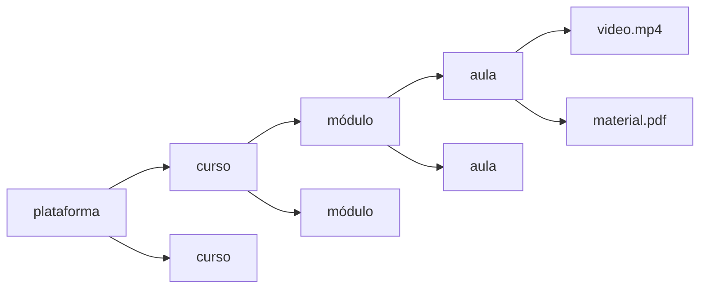
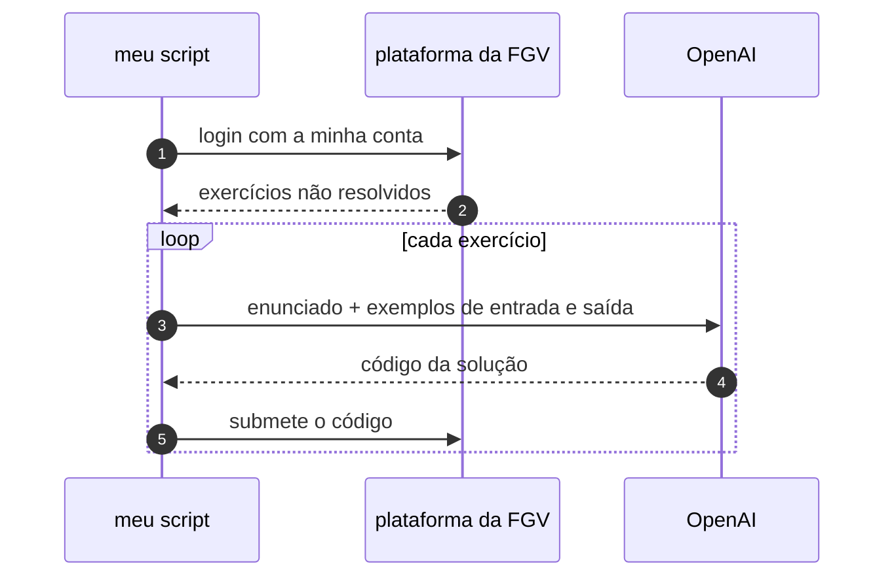
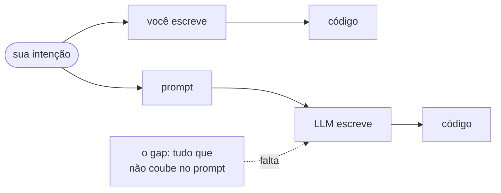
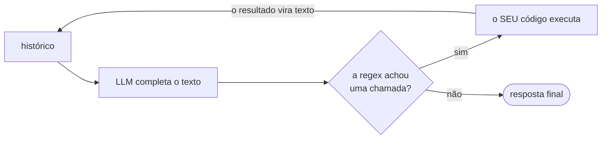
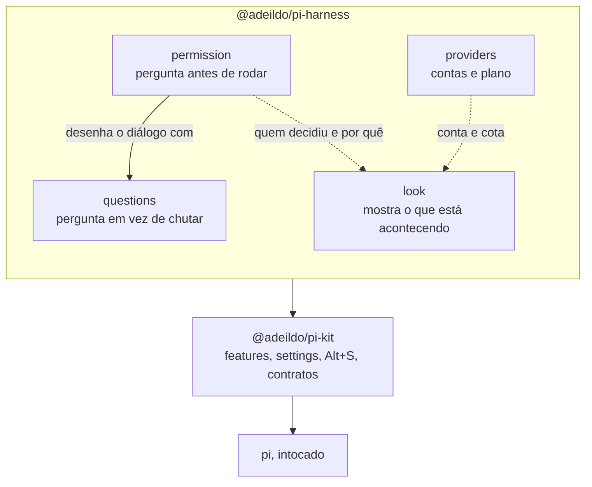
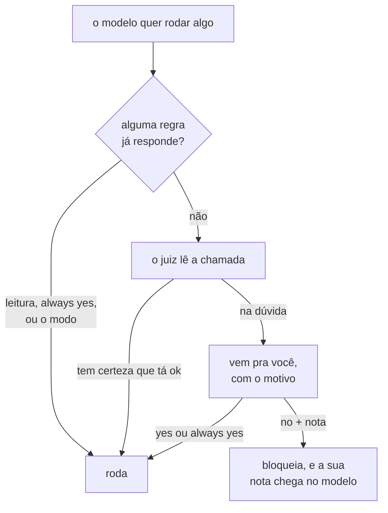
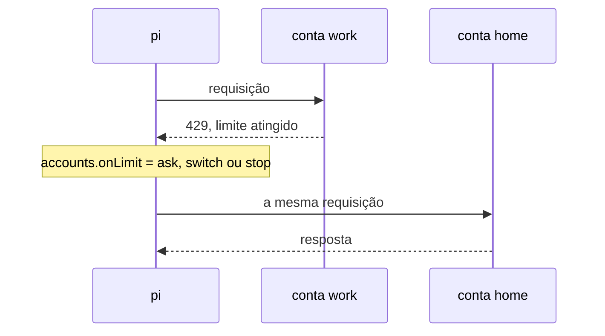

# Sim, outro harness de coding agent

Eu sei, eu sei. Sai um harness novo por semana, e cada um jura que é o definitivo. Esse aqui não é definitivo. É **o meu**: um punhado de extensões em cima do [pi](https://pi.dev) que fazem o agente pedir licença, perguntar em vez de chutar, e mostrar o que está acontecendo.

Mas antes de chegar nele, vale entender de onde vêm as opiniões que ele carrega. E, de quebra, desmistificar essa história de "dar ferramentas a uma IA". Spoiler:

{ loading=lazy width="600" }
/// caption
Sempre foi regex em cima de texto!
///

<!-- more -->

!!! abstract "Sem tempo? O post em quatro linhas"

    - Programar é traduzir **intenção** em código. Um LLM é um interpretador de intenção, e o problema dele é o **gap**: tudo que estava na sua cabeça e não coube no prompt.
    - "Tool calling" é um completador de texto rodando em loop, com uma regex em cima. Skills, workflows e companhia são nomes bonitos pra isso.
    - Então um bom harness não é o que te tira do loop. É o que deixa **barato entrar nele**: negar com um motivo, responder uma pergunta, ver o que está rodando.
    - Daí nasceu o [`@adeildo/pi-harness`](https://github.com/felipeadeildo/pi-harness). Não é fork: `pi install npm:@adeildo/pi-harness` e pronto.

## De onde vem essa mania de opinar

### Um script de 3 mil linhas e zero vergonha

Comecei a programar lá pra 2020, quando finalmente tive meu primeiro notebook. Saí escrevendo meio mundo de script Python pra automatizar tudo que aparecia na frente, e pulando, com muito orgulho, tudo que dizia respeito a "Python profissional". Não sabia o que era classe, o que era módulo... era tudo one-file-script.[^one-file]

E de alguma forma funcionava. Eu olhava pra um script de 3 mil linhas, cheio de repetição, variável mal nomeada, função espalhada pra todo lado, sem type hint, sem teste, sem nada, e do alto dos meus 12 anos decorava tudo, sabia onde estava cada coisa e continuava lançando feature como um louco.

Bons tempos. Talvez de lá pra cá eu tenha tido um downgrade: hoje eu olho pra uma codebase daquelas e simplesmente :sparkles: não consigo entender :sparkles: hahaha.

### Perguntar "por quê?" pra tudo

O que mudou foi que eu fui entendendo a motivação de cada coisa, e o que cada uma evitava. Por que eu preciso de teste? Por que eu preciso de type checking? Por que eu preciso modularizar? E a pergunta que eu mais gostava de fazer: ==como eu reescreveria isso aqui?==

Eu nunca fiz dois projetos iguais trocando só as variáveis. Cada um seguia uma regra diferente: framework, capacidades, jeito de escrever. Isso mudou muito com o tempo e continua mudando (apesar da IA).

Um exemplo é [este script que baixa cursos da Rocketseat](https://gist.github.com/felipeadeildo/961587b1f5660a5db42102666e9884d0?permalink_comment_id=5067970#gistcomment-5067970), um dos poucos dessa categoria que deixei público (you know why, don't you?). Lá no final tem uns comentários meus sobre como abstrair aquilo: e se uma plataforma de curso fosse uma **árvore**?


/// caption
Cada nó só precisa saber listar os filhos. As folhas viram arquivo no disco.
///

Esse questionamento tem dois lados. O bom: me mantém atualizado. O perigoso: me faz pegar um projeto novo, tipo [este aqui](https://github.com/NES-Collaborate/nes-website), sem dominar a tecnologia, e meter a cara mesmo assim, passando dia e noite construindo enquanto aprendo a própria ferramenta.

E ele me deixou com algumas opiniões que dá pra chamar de fortes, e que continuam sendo forjadas: sobre stack, ferramenta, jeito de desenvolver, fluxo de trabalho. Uma alergia a adotar coisa só pelo hype, e a mania de precisar saber o que acontece under the hood antes de começar a usar.

Então, por que não opinar sobre o que faz um harness ser "bom"? Nos **meus** termos, claro.

## E Deus disse: haja IA!

No fim de 2022 a OpenAI soltou o ChatGPT, em cima do GPT-3.5: o primeiro LLM que virou mainstream de verdade. No começo de 2023, eu estava fazendo curso de verão na FGV EMAp, dois ao mesmo tempo:

1. **Introdução à Programação com Python.** Easy easy, eu tava lá só pelas horas de curso.
2. **Análise Real.** Puta que pariu, que curso complicado. Eu tava morrendo, alguém me ajuda.

Como eu tinha muito tempo sobrando (contém ironia), peguei uma chave de API e escrevi um script simples:



E foi assim que eu ganhei tempo: fazendo a IA escrever o código que eu teria que gastar tempo escrevendo. Passei com A+.[^fgv]

Ali caiu a ficha: isso é uma puta solução. Tirando o custo de rodar um modelo desses, isso ia mudar o jeito que a gente escreve código. Se evoluísse até virar um **interpretador de intenções** bom o bastante pra ser uma camada de abstração entre mim e o código, ia mudar até o jeito que a gente usa linguagem de programação.

Liguei pro meu grande amigo [Tiago Trindade](https://github.com/TiagoCavalcante), e a gente teve uma longa conversa sobre o que é ser programador e como seria o futuro... mas isso é história pra outro post.

## Interpretador de intenções... mas como?

Escrever código é, na prática, expor uma intenção de forma procedural: passo a passo, detalhado em linhas de código.

Exemplo: você precisa contar pro seu chefe (ou CTO) o que fez na última semana. Na mão, você vai no histórico de commits ou nas suas anotações, resume aquilo e manda. Essa é a sua intenção. Em código, ficaria mais ou menos assim:

```python title="weekly.py"
from datetime import datetime, timedelta

github = GitHub(token=...)
slack = Slack(token=...)

since = datetime.now() - timedelta(days=7)  # (1)!

done = [
    f"- {repo.name}: {commit.message}"
    for repo in github.repos(org="minha-org")  # (2)!
    for commit in repo.commits(author="felipeadeildo", since=since)  # (3)!
]

slack.send("#daily", "O que eu fiz na última semana:\n" + "\n".join(done))  # (4)!
```

1.  "Última semana" virou os últimos 7 dias corridos. Não é de segunda a sexta, não é desde a última reunião. **Você** decidiu.
2.  Só os repositórios da organização. O side project de sábado ficou de fora. **Você** decidiu.
3.  "O que eu fiz" virou commits. PR revisado, call de duas horas, bug investigado que não gerou commit: nada disso conta. **Você** decidiu.
4.  "Contar pro chefe" virou mandar no canal `#daily`. Não é DM, não é e-mail. Adivinha quem decidiu.

Clica nos marcadores do código: cada linha é uma decisão que só existia na sua cabeça. Escrevendo, **você** foi o tradutor da sua intenção pra código, que depois vai ser interpretado ou compilado e executado.

Um LLM como assistente de código faz exatamente esse papel de tradutor, só que de fora: você passa a intenção em linguagem natural (não em linguagem de programação), e ele se vira pra transformar aquilo em código.


/// caption
Em cima, zero camadas de interpretação. Embaixo, uma camada, e um buraco.
///

O problema é essa camada no meio (uma camisinha entre você e o código, basicamente). Quando você escreve o código, não tem interpretação nenhuma: você **é** a intenção, você é a janela de contexto, você sabe onde quer chegar. E quando falta alguma coisa, suas sinapses fazem o retrieval e fecham o gap na hora.

O LLM só tem o prompt. E o prompt nunca é tão profundo quanto o que está na sua cabeça, porque a gente é preguiçoso e odeia escrever especificação. Aí ele escreve diferente do que você imaginou. Não porque é burro: porque faltou informação. E, por design, ele não fecha esse gap sozinho, porque o que falta só existe na sua cabeça.

Então, se você quer a sua intenção virando código do jeito que imaginou, ==você precisa entrar no loop== pra fechar esses gaps.

!!! tip "Guarda essa frase"

    Ela é a tese deste post. Tudo que eu construí lá no final existe pra deixar **barato** entrar no loop.

Como disse o Akita, no auge: ["o ChatGPT é só um completador de texto glorificado"](https://youtu.be/O68y0yRZL1Y). Segura essa também, que ela vai ser útil daqui a pouco.

## Uma breve (e enviesada) história das ferramentas

### 1. Autocomplete no VS Code

Mesmo assim eu tentei. A primeira versão foi uma extensão do VS Code pra completar código, que hoje não tem nem rastro no GitHub. Naquele começo, com janela de contexto minúscula, era muito mais fácil prever o que eu ia escrever do que escrever algo grande.

A ideia era simples: fiquei 5 segundos parado, ela mandava o arquivo pra OpenAI e me mostrava o resto.

=== "O que eu escrevi"

    ```python
    # fibonacci

    def fib(n: int) -> int:
        ...
    ```

=== "5 segundos depois"

    ```python hl_lines="4"
    # fibonacci

    def fib(n: int) -> int:
        return n if n in (0, 1) else fib(n - 1) + fib(n - 2)
    ```

Mágico! Funcionava que era uma beleza. Mas não bastava: numa codebase dividida em arquivos, fazia muito mais sentido mostrar os outros arquivos também, e a janela de contexto não deixava. Aí vieram a engenharia de contexto e as ferramentas de contexto sob demanda.

### 2. "Dar ferramentas" ao LLM

O LLM precisava de uma coisa só: mais contexto, pra acertar mais em codebase grande. E a solução, nessa extensão, foi bem simples: inventar uma sintaxe pra chamar ferramenta, e explicar ela no system prompt.

```text title="system prompt"
Você é um agente de código especializado em terminar
código escrito por outro dev.

Na dúvida sobre o contrato de alguma coisa, explore com esta sintaxe:

>>> listar <pasta>
>>> ler <arquivo>

Exemplos:

>>> listar
pyproject.toml
src/
README.md

>>> ler src/core.py
def fib(n: int) -> int:
    return n if n in (0, 1) else fib(n - 1) + fib(n - 2)

Pare de escrever logo depois de uma chamada. O resultado aparece no lugar dela.
```

E o loop da extensão era mais ou menos isso aqui:

```python title="extension.py"
import re
from pathlib import Path

TOOLS = {
    "listar": lambda arg: "\n".join(p.name for p in Path(arg or ".").iterdir()),
    "ler": lambda arg: Path(arg).read_text(),
}
CALL = re.compile(r"^>>> (listar|ler) ?(.*)$", re.MULTILINE)  # (1)!

history = [
    {"role": "system", "content": SYSTEM_PROMPT},
    {"role": "user", "content": f"Complete o arquivo {path}:\n{path.read_text()}"},
]

while True:
    response = complete(history)  # (2)!
    calls = CALL.findall(response)
    if not calls:  # (3)!
        break
    results = "\n".join(TOOLS[name](arg) for name, arg in calls)  # (4)!
    history += [
        {"role": "assistant", "content": response},
        {"role": "user", "content": results},
    ]

print(response)
```

1.  A "API de ferramentas" inteira. Uma regex.
2.  O completador de texto glorificado. Ele não sabe que existe ferramenta nenhuma: só escreve texto que, por acaso, casa com a regex.
3.  Nenhuma chamada na resposta? Acabou, essa é a resposta final.
4.  Quem executa é o **nosso** código, não o modelo. O resultado volta pro histórico como mais um texto qualquer.

O de verdade era bem mais elegante que isso, mas a essência é essa:



!!! info "Então é isso"

    Dar ferramentas a um LLM é fazer **regex em cima de output estruturado**. Não existe "poder" nenhum. É um completador de texto que a gente roda várias vezes, com uma regex em cima de cada resposta pra mapear o resultado numa ferramenta implementada na mão. Nada além disso.[^json]

### 3. A era das CLIs

Isso virou passado rapidinho. Foi aparecendo coisa muito mais legal, e o próprio VS Code começou a lançar coisas pra facilitar a integração com essas ferramentas de IA.

Até que alguém perguntou: precisa mesmo rodar dentro de uma IDE? Eu não preciso de IDE pra listar e ler arquivo, muito menos pra **editar**. Expõe uma tool `edit` com uns argumentos e boa.

E assim chegou a era das CLIs!!!

| Quando | Quem | O que trouxe |
| --- | --- | --- |
| mai. 2023 | [Aider](https://aider.chat) | Quem começou. Nasceu junto com o GPT-4, e logo virou agnóstico de modelo |
| fev. 2025 | [Claude Code](https://www.anthropic.com/claude-code) | O mais maduro, mas focado no ecossistema da Anthropic. Ferramentas bem abstraídas, subagents em paralelo, e um monte de paradigma quebrado sobre o que é ambiente de programação |
| abr. 2025 | [Codex CLI](https://github.com/openai/codex) | Sinceramente, uma bosta no lançamento (hoje melhorou muito). Basicamente uma tool só, `shell`, num modelo que ainda não sabia usar shell Unix |

No Codex daquela época, `list` era `shell("ls")`, `read` era `shell("cat arquivo.ext")` e `edit` era `shell("sed ...")`. O modelo não tinha refinamento pra isso, e dava pra sentir.

Quem fez isso muito bem, e continua fazendo enquanto escrevo, foi a Anthropic. Claro que pra isso o modelo também teve que evoluir: uma camada de pós-treinamento só pra chamar ferramenta, vulgo escrever bons JSONs no formato especificado.

### 4. Onde a galera perdeu a linha

Repara: na prática, um LLM não precisa de mais de duas ferramentas pra se virar.

```python
def read(path: str) -> str: ...  # (1)!
def edit(path: str, old: str, new: str) -> None: ...  # (2)!
```

1.  Num arquivo, devolve o conteúdo. Numa pasta, devolve o que tem dentro.
2.  Troca `old` por `new` no arquivo. Só.

!!! quote "Fun fact"

    Passa ano, entra ano, e a gente não consegue fugir do input/output.

O resto é conforto:

- **search**: nada mais que um `grep`. Se quiser luxo, um grep em cima da AST.
- **bash**: esse é maravilhoso, porque com um modelo bom o bastante (não era o caso da OpenAI no começo de 2025), só ele já abstrai o `read` e o `edit`.

A galera se perdeu quando o hype começou. Foi uma loucura: muita desinformação sobre as capacidades, muita gente falando merda na internet, e todo mundo achando que estava tudo perdido, porque se o LLM "escreve código melhor que eu", com as ferramentas certas ele me substitui. Que bagunça isso virou.

Do nada, 1001 ferramentas, tools, workflows, skills e não sei o quê lá. Mano, tudo isso é regex em cima de output estruturado, pra trazer contexto sob demanda e executar ferramenta. Mas o mundo precisava de hype, então deram 1001 nomes pra input/output condicional a um match de regex. Louco, né?

| O nome bonito | O que é de verdade |
| --- | --- |
| Tool calling | O modelo escreve um JSON, o harness faz o match e executa a função |
| Skill | Um prompt num `.md`, hospedado num [skills.sh](https://skills.sh) da vida. Um ++ctrl+c++ ++ctrl+v++ com marketing |
| MCP | Um servidor que lista as próprias tools e responde quando chamam |
| Subagent | O mesmo loop rodando de novo, com o histórico limpo |

## Onde o Claude Code me perdeu

Por um bom tempo, o Claude Code foi pra mim o estado da arte de harness de CLI. Introduziu vários conceitos legais, úteis de verdade, que dão um bom controle pra quem usa.

Só que ele é de uma empresa privada, com o objetivo de controlar o mercado, e o harness ficou quase impossível de usar fora de um modelo da casa. Funcionalidades ótimas... que só funcionam bem se o seu provider for a Anthropic, ou um gateway dela. E por vários motivos:

- :lucide-book-open: **System prompt do tamanho de uma Bíblia.** Iniciar uma sessão com modelo local, numa máquina normal, fica simplesmente lento demais.
- :lucide-puzzle: **Assinaturas de tool difíceis de representar**, a não ser que o seu modelo tenha passado por um pós-treinamento específico pra aquele caso de uso.
- :lucide-lock: **Auto mode com critério proprietário.** Quem decide o que é aceito sozinho é a Anthropic, e nem sempre ela faz um bom trabalho nisso.

Resumindo: a maior dificuldade é rodar coisa diferente dentro da carcaça do Claude Code. Só isso.

!!! note "Sim, eu sei que dá pra trocar o endpoint"

    Dá pra definir profiles com endpoints diferentes. Eu inclusive escrevi um [gestor de contas do Claude Code](https://github.com/felipeadeildo/claude-code-profiles) que usa exatamente isso. Só que isso não resolve o resto da lista.

## Procurando casa nova

Na busca por alternativa, passei por `opencode`, `opencode2`, `aider`, `hermes`, `fx.sh` e por aí vai. Cheguei até a revisitar o `codex` (que melhorou muito, btw).

Só que todos eles, por algum fucking motivo, assumiam que eu quero fazer as coisas **one-shot**, sem human-in-the-loop: sem eu dar feedback, responder pergunta, permitir ou negar alguma coisa. Nem todos tinham tudo, mas a maioria compartilhava estas deficiências:

1. :lucide-shield-off: **Editar tudo by default.** Começavam com permissão pra editar qualquer coisa, o que eu acho ousado demais.
2. :lucide-eye-off: **Visibilidade truncada.** Qual arquivo, o quê, por quê, o thinking, a decisão: tudo meio escondido.
3. :lucide-message-square-x: **Permissão binária.** O diálogo era `yes` ou `no` e só. Se eu negasse, o agente recebia `the tool call was denied by the user` e mais nada: sem motivo, sem follow-up. Lembra do gap? Pois é: eu negava e o gap continuava lá, intacto.
4. :lucide-bug: **Não eram o Claude Code.** Uma funcionalidade bem feita de um lado, outra bugada do outro.
5. :lucide-gauge: **Performance.**

Guarda essa lista. Ela volta no final.

### Amor à primeira vista: pi.dev

Até que um amigo, o [Bruno Assis](https://www.linkedin.com/in/brunoassis88/), me apresentou o [pi.dev](https://pi.dev). Foi amor à primeira vista.

Minimalista, extensível, direto ao ponto. Uma página em branco esperando pra ser pintada! Bem mais perto de outras TUIs, e com opiniões fortes sobre o que é uma tool.

### Sem tempo pra fazer o meu (ainda): Oh My Pi

Fazer um bom harness leva tempo, então fui ver o que a comunidade já tinha feito em cima disso. Conheci o [Oh My Pi](https://omp.sh), que não podia ter nome melhor pra uma versão opinionated hahaha. Simplesmente perfeito: TUI ótima, bonita, configurável, cheia de coisa útil de verdade.

Mas ainda falhava em algumas coisas. O feedback ao aceitar ou negar uma tool, por exemplo. E não tinha política tipo "accept edits" ou "manual mode": era 8 ou 80, sem meio-termo configurável.

Usei por um bom tempo, é um trabalho excelente. Mas tem uma pegadinha:

!!! info "O omp não é o pi"

    É um fork do pi, atualizado com o upstream. Tipo o que o Arch Linux é pro kernel Linux. Isso não é problema nenhum, só é bom ter em mente.

### pi puro + extensões, sem fork

Depois de uma overdose de funcionalidade no omp, e já sabendo o que era possível fazer, voltei pro pi e fui olhar a lista de extensões. Algumas merecem meus devidos respeitos:

<div class="grid cards" markdown>

-   :lucide-layout-panel-top:{ .lg .middle } **[pi-open-tui](https://github.com/OldSuns/pi-open-tui)**

    ---

    Uma interface limpa e bonita em cima do pi, e configurável.

-   :lucide-message-circle-question:{ .lg .middle } **[rpiv-ask-user-question](https://github.com/juicesharp/rpiv-mono/tree/main/packages/rpiv-ask-user-question)**

    ---

    Um diálogo bem Claude Code pro LLM te fazer perguntas: fechar o _gap de informação_ e decidir junto com você.

-   :lucide-key-round:{ .lg .middle } **[pi-claude-max](https://github.com/bradennss/pi-claude-max)**

    ---

    Intercepta o stream da API da Anthropic e injeta os headers do Claude Code CLI, pra cobrar da assinatura em vez do extra usage. (De novo, Anthropic: por quê?)

-   :lucide-users:{ .lg .middle } **[pi-multiprovider](https://github.com/monotykamary/pi-multiprovider)**

    ---

    Mais de uma conta pro mesmo provider, tipo Anthropic pessoal + Anthropic da Ranqia. A mesma ideia do meu claude-code-profiles.

-   :lucide-globe:{ .lg .middle } **[pi-web-access](https://github.com/nicobailon/pi-web-access)**

    ---

    Busca e leitura da internet pro LLM, com resumo.

-   :lucide-brain:{ .lg .middle } **[pi-memory](https://github.com/jayzeng/pi-memory)**

    ---

    Memória em markdown puro: fatos e decisões duráveis, um log diário e um scratchpad. Com o qmd, ganha busca por palavra-chave, semântica e híbrida.

</div>

Entre outras! Foi um mundo novo.

### A extensão que faltava: pi-ask-permission

Ainda faltava uma do meu gosto, e pelo jeito a experiência que eu queria só ia existir se eu mesmo fizesse. Nasceu a [pi-ask-permission](https://pi.dev/packages/pi-ask-permission) (_deprecated, ok?_): antes de qualquer tool que não seja só leitura, ela me pede permissão, numa interface assim:

{ loading=lazy }
/// caption
Um `no` com uma nota que o modelo lê: _use pnpm instead_.
///

Repara no `no`: ele agora carrega um **motivo**. O agente não recebe só "negado", recebe o que fazer no lugar. É o item 3 da lista resolvido, e é literalmente fechar o gap.

Depois do lançamento do [Jev, da Typesafe](https://typesafe.ai/blog/introducing-system-one-models-and-jev), um modelo classificador, eu dei um **juiz** a ela. Um modelo pequeno lê a chamada (a tool e os argumentos) e decide se ela roda sozinha ou se vem pra mim:

{ loading=lazy }
/// caption
Uma chamada que o juiz aprovou, uma que um _always yes_ liberou, e uma que veio pra mim.
///

## E Adeildo disse: haja harness opinionated!

Nem tudo são flores. Aos poucos, aquilo virou um Frankenstein de extensões de terceiros. Não é ruim, mas umas coisinhas incomodavam. Cheguei a abrir PR pra resolver algumas, mas é a **minha** opinião contra a dos mantenedores, e o tempo de resposta não era tão rápido quanto eu queria pra ter a última versão das coisas na minha máquina.

Então resolvi reimplementar tudo num monorepo, com estado compartilhado e um padrão de UI. Algo bem parecido com o que o omp se propõe a fazer, só que **sem virar fork**.

Assim nasceu o [@adeildo/pi-harness](https://github.com/felipeadeildo/pi-harness): tudo que eu uso no dia a dia, do jeito que eu acho que essas ferramentas deveriam funcionar e parecer. A experiência que eu, como dev, queria ter montando um LLM qualquer.

```sh
pi install npm:@adeildo/pi-harness
```

{ loading=lazy }
/// caption
Uma sessão inteira: o card de início, o pedido, o juiz liberando o commit, e o rodapé dizendo quanto custou e quanto sobra do plano.
///

E tem umas regras das quais eu não abro mão:

- [x] Bonito, elegante, confortável e intuitivo.
- [x] Nada de 1001 comandos pra fazer coisas distintas: **uma** tela de configuração, no ++alt+s++.
- [x] Poucos passos e você tá PRONTO pra usar.
- [x] Sem fork. O `pi remove` devolve o pi do jeito que estava.

### Como as peças se encaixam

São quatro peças, e todas são features de uma mesma biblioteca, o kit. Uma peça nunca importa a outra: elas conversam por **contratos**, eventos em JSON puro trafegando no `pi.events`.


/// caption
As setas pontilhadas são contratos: se uma peça não está instalada, a outra só não recebe o evento.
///

Quer uma peça só? Cada uma também é um pacote próprio: `pi install npm:@adeildo/pi-look` traz a tela e mais nada. E o `pi config` desliga qualquer uma delas.

### :lucide-shield-check: Permission: pergunta antes de rodar

O pi, de fábrica, roda qualquer comando sem perguntar. Essa peça faz ele perguntar, e responde as perguntas fáceis por você. Toda chamada passa por aqui:



Ela começa no modo mais conservador (adeus, item 1 da lista), e ++alt+m++ troca de modo:

| Modo | Roda sem perguntar |
| --- | --- |
| `manual` | Leituras e o que você marcou como _always yes_. É o padrão |
| `edits` | O mesmo, mais edição e escrita de arquivo |
| `judge` | O mesmo que `edits`, e o juiz decide o resto |
| `full` | Tudo. Boa sorte |

Uma regra vale acima do modo: chamada fora do workspace **sempre** pergunta, até no `full`. O ++alt+w++ libera isso pela sessão, com um `anywhere` em vermelho na barra de status pra você não esquecer.

=== "Always yes"

    { loading=lazy }

    O _always yes_ pergunta **o quê** lembrar, e depois **por quanto tempo**: a sessão, o projeto, ou todo lugar. A primeira opção é sempre a mais estreita, e é a que você quer: `pnpm` aprovaria `pnpm publish` junto.

=== "A pasta vizinha"

    { loading=lazy }

    Num monorepo, uma sessão em `apps/api` que lê `apps/web` sai do workspace. O diálogo avisa, e oferece abrir aquela pasta só pra **leitura**. Escrita lá fora continua perguntando.

??? info "Como o juiz decide"

    No modo `judge`, um modelo responde toda chamada que não é leitura nem edição, então você só vê as que ele duvidar. Ele roda nos classificadores do próprio pi (`ctx.modelRegistry.classify()`), então não tem prompt meu nem provider meu pra manter.

    Uma chamada roda quando o juiz aprova com pelo menos a confiança do rigor escolhido, e o risco fica abaixo do teto:

    | Rigor | Confiança | Teto de risco |
    | --- | --- | --- |
    | `cautious` | 85% | 0.45 |
    | `balanced` (padrão) | 70% | 0.50 |
    | `relaxed` | 55% | 0.60 |

    A política é texto puro, então você começa de um preset e edita:

    ```text
    # May run without asking
    - Running tests, linters, type checks, and builds
    - git status, diff, log

    # Must always ask first
    - sudo, or anything that changes system-wide state
    - Anything that reaches the network

    # When in doubt
    Ask me.
    ```

    Começa com o **dry run** ligado: o juiz escreve o veredito na chamada, mas quem decide ainda é você. Depois de umas sessões concordando com ele, desliga.

### :lucide-message-circle-question: Questions: pergunta em vez de chutar

Essa é a peça que mais conversa com a tese do post. Em vez de chutar quando falta informação, o modelo te **pergunta**, e cada pergunta vem com opções, um preview do que cada uma vira, e uma linha pra você escrever a sua própria resposta.

{ loading=lazy }
/// caption
Duas perguntas em abas, e o preview da opção em foco.
///

O pulo do gato são as **notas**: ++tab++ escreve uma nota em qualquer opção, escolhida ou não. E é isso que o modelo lê de volta:

```text
The user answered:
- Layout: "Which layout should the accounts section use?" → "Tree (Recommended)"
  note on "Tree (Recommended)": fits how I think
  note on "Flat list" (not picked): too long with five accounts
Continue with these answers in mind.
```

"Muito longo com cinco contas", numa opção que eu **nem escolhi**, diz mais pro modelo do que a escolha sozinha. Isso é gap sendo fechado.

E o diálogo de permissão é **esse mesmo** diálogo por baixo, então os dois têm as mesmas teclas: ++arrow-up++ ++arrow-down++ pra andar, ++enter++ pra escolher, ++tab++ pra nota, ++esc++ pra sair.

### :lucide-monitor: Look: mostra o que está acontecendo

O item 2 da lista. A tela inteira é desenhada em volta dos números que importam enquanto o agente trabalha.

{ loading=lazy }
/// caption
O card de início, e um prompt no meio da resposta.
///

E toda chamada de tool ganha uma caixa própria (aquela lá de cima, do juiz): o que vai rodar, quem deixou e por quê, o output, e quanto tempo levou.

!!! tip "A tela não dança"

    Não sou o melhor cara de design, mas sei muito bem o que me incomoda numa UI. E o que mais me incomoda é tela **dançando**: um contador sem número tabular, que empurra a linha inteira pro lado toda vez que passa de `9` pra `10`, ou um valor que surge do nada no meio da linha e desloca todo o resto.

    Então aqui é TOC assumido: todo número tem largura fixa, valor que ainda não existe aparece como `–` em vez de brotar depois, e a faixa e o rodapé já nascem ocupando a linha deles. O cronômetro corre e mais nada se mexe.

### :lucide-key-round: Providers: o plano que você já paga

Com um plano Pro ou Max conectado no `/login anthropic`, as requisições do pi contam como extra usage, cobrado por token. Essa peça faz elas saírem do plano, igualzinho às do Claude Code.

!!! warning "Lê as letras miúdas"

    Ela faz isso apresentando o pi pra Anthropic como Claude Code, e usar a assinatura fora do Claude Code pode quebrar os termos da Anthropic. Não quer isso? Desliga a feature no `pi config`. Requisição com API key sai intocada.

E ela guarda **várias contas** por provider. O `/accounts` adiciona usando o próprio login do pi (nada de OAuth meu), ++alt+a++ troca a conta da sessão, e cada uma mostra quanto do plano ainda tem. Quando uma bate no limite, a próxima assume:



Só troca se nada foi mostrado ainda, então um retry nunca repete na sua cara um texto que você já leu.

### :lucide-blocks: O kit, pra quem quer escrever a própria peça

Por baixo de tudo isso tem o [`@adeildo/pi-kit`](https://github.com/felipeadeildo/pi-harness/tree/main/packages/kit). Uma feature é um objeto, e o kit dá a ela settings tipadas, uma aba no ++alt+s++ e um interruptor no `pi config`:

```ts title="subscription.ts"
import { createApp, defineFeature, matching, setting } from "@adeildo/pi-kit";
import type { ExtensionAPI } from "@earendil-works/pi-coding-agent";

export const version = setting({
	id: "subscription.claudeCodeVersion", // (1)!
	default: "2.1.280",
	decoder: matching(/^\d+\.\d+\.\d+$/, "a version like 2.1.280"), // (2)!
});

export const subscription = defineFeature({
	id: "subscription",
	description: "Bill Anthropic OAuth requests to the Claude plan",
	settings: [version],
	setup(scope) { // (3)!
		scope.on("before_provider_headers", (event) => {
			event.headers["user-agent"] = `claude-cli/${version.get(scope)}`;
		});
	},
});

export default function (pi: ExtensionAPI): void {
	createApp(pi, { name: "pi-harness" }).use(subscription).build();
}
```

1.  O `id` é o caminho da chave no arquivo de settings, que todas as peças compartilham.
2.  Valor que não decodifica é ignorado, com um aviso dizendo o arquivo e a chave.
3.  O `scope` é a própria API de extensão do pi, com os erros já prefixados com o nome da feature. Feature desligada nunca roda o `setup`, então não registra nada e não custa nada.

### A lista de reclamações, revisitada

Prometi que ela voltava:

| | O que me deixava puto | Onde o harness resolve |
| --- | --- | --- |
| 1 | Editar tudo by default | **Permission** começa no `manual`, e cada modo é uma escolha sua |
| 2 | Visibilidade truncada | **Look**: cada chamada numa caixa, com quem decidiu, o output e o tempo |
| 3 | Permissão binária | O `no` leva uma **nota**, e o modelo ainda pode **perguntar** antes de chutar |
| 4 | Não eram o Claude Code | O diálogo, os modos e o juiz no espírito do Claude Code, em cima de qualquer modelo |
| 5 | Performance | O pi já é leve, e o look só redesenha uma chamada quando ela muda, com um teste de performance guardando isso |

### O que vem por aí

Hoje o harness ainda é bem vanilla em memória, acesso à web, acesso remoto e multi-agent. É pra lá que ele vai:

- [x] Permissão com nota, modos, _always yes_ em três escopos, e o juiz
- [x] Perguntas com preview e nota
- [x] O look: card de início, editor emoldurado, caixa por chamada, rodapé
- [x] Várias contas, troca no limite, e o plano no rodapé
- [ ] Um ledger de uso, e um `/usage` com o que o plano diz que sobra do lado do que eu gastei
- [ ] Estado de sessão, compaction estruturada e memória (no lugar do pi-memory)
- [ ] Sessões conversando entre si, e subagents com os diálogos de permissão encaminhados pro pai
- [ ] Busca e leitura na web (no lugar do pi-web-access)
- [ ] Uma ponte remota e uma web UI, pra aprovar chamada pelo celular com a mesma política

O plano inteiro, com o porquê de cada item, está no [`ROADMAP.md`](https://github.com/felipeadeildo/pi-harness/blob/main/ROADMAP.md).

## Considerações

Antes que alguém venha: eu não me acho o dono da cocada preta. Faço isso porque são as minhas opiniões. Não gostou? Discorda? Faz um fork, faz melhor, eu não tô nem aí. Ou melhor: abre um PR lá kkkkk.

A ideia aqui foi mostrar como eu enxergo essas novidades de IA, e como várias delas são bem slop. Lembra da skill? Um prompt em `.md` hospedado em algum lugar. Uma forma legal de dar ++ctrl+c++ ++ctrl+v++, grande coisa.

Também não sou portador de todo o conhecimento do mundo, e tô bem longe do estado da arte dos "workflows agênticos galácticos do improvement loop dos deuses". Tem muita coisa que eu ainda não sei direito como funciona. Mas o que eu uso tem me servido muito bem até aqui.

Só tem uma coisa que não pode quebrar:

!!! danger "A responsabilidade é sua"

    Fazer algo de qualidade não é responsabilidade da IA. **É sua.** Se você não sabe, numa camada boa o bastante, que caralhos está acontecendo na sua aplicação, na arquitetura, no que você está desenvolvendo, a chance de dar merda é enorme. E não por incapacidade da IA: por incapacidade sua. É skill issue.

No fundo, é o gap de novo. Ele é seu de fechar. O harness só deixa isso mais barato.

E fica o convite: quem quiser colaborar com ideias, chega junto. A proposta é fazer algo bom de verdade, com carinho, pensando na experiência de cada feature. Não é ter feature por ter: é implementar coisa que **nós mesmos** usaríamos no dia a dia, saca? Bem fechado, com começo, meio e fim.

É isso. Pra cima! Bora, biu!

[^one-file]: Um programa inteiro num arquivo só: sem módulo, sem pacote, sem separar responsabilidade. Tudo de cima pra baixo, num `script.py` gigante que você roda com `python script.py` e reza.

[^fgv]: Sorry, FGV. Em minha defesa, até então não tinha nenhuma regra sobre usar IA :D

[^json]: Hoje a "sintaxe" é um JSON com schema, e os modelos passam por um pós-treinamento só pra escrever esse JSON direitinho. Fica bem mais robusto, mas a ideia é a mesma: o modelo escreve, o harness executa.

*[LLM]: Large Language Model: o modelo que completa texto.
*[LLMs]: Large Language Models: os modelos que completam texto.
*[TUI]: Terminal User Interface: interface desenhada dentro do terminal.
*[TUIs]: Terminal User Interfaces: interfaces desenhadas dentro do terminal.
*[CLI]: Command-Line Interface: um programa que você usa pela linha de comando.
*[CLIs]: Command-Line Interfaces: programas que você usa pela linha de comando.
*[IDE]: Integrated Development Environment, tipo o VS Code.
*[AST]: Abstract Syntax Tree: a árvore que o parser monta a partir do código.
*[MCP]: Model Context Protocol: um protocolo pra expor ferramentas a um modelo.
*[omp]: Oh My Pi, o fork opinionated do pi.
*[sinapses]: Os pontos de contato entre neurônios, por onde o sinal passa de um pro outro. A memória fica guardada na força dessas conexões.
