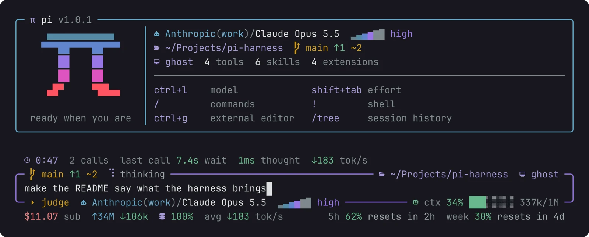
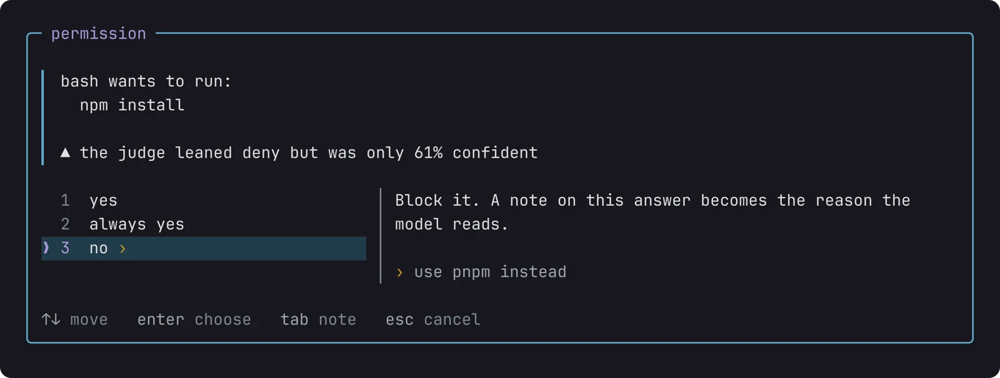

# agents

I use one AI agent, [Pi](https://pi.dev/), in the terminal. Pi comes small on purpose. You get a model, four or five tools and an editor, and the rest you add with packages. So what makes my Pi mine is which packages I install and how I set each one up, and that's what this page is about.


/// caption
Pi when it starts, with the header and footer from [pi-open-tui](#pi-open-tui).
///

## Install

``` sh
curl -fsSL https://pi.dev/install.sh | sh
pi
```

The script looks for Node and npm, then installs Pi with the `npm` of whatever Node is active. Here that's Node 24, from [fnm](../workbench/index.md#languages). It also puts Pi's folder on the `PATH` in your shell config. That's the `# Pi` line at the end of my [`config.fish`](../workbench/index.md#what-i-added), I didn't write it.

Then `/login anthropic` inside Pi connects my Claude subscription. I leave it on Claude Opus 5.5, medium effort.

## Settings

I left most settings alone. These are the ones I changed, in `~/.pi/agent/settings.json`:

| Setting | What it does |
| --- | --- |
| `tuiMode`: fullscreen | the editor and the status bar stay put, and only the conversation scrolls |
| `outputPad`: 0 | no side padding on the conversation, so code blocks get the full width |
| `steeringMode`: all | messages I send while it's working all arrive together after the current step, instead of one per step |
| `followUpMode`: all | same, for follow-ups (++alt+enter++), which wait until the whole task is done |
| `showCacheMissNotices` | tells me when the prompt cache missed, which is when a turn costs a lot more |
| `enableInstallTelemetry`: false | no anonymous install and update reports |
| `warnings.anthropicExtraUsage`: false | stops warning about paid extra usage, since [my extension](#pi-use-anthropic-subscription) makes it bill the subscription |
| `defaultModel`: claude-opus-5-5 | the model every new session starts with |

## Extensions

Each extension is one line in `settings.json`. `pi install` writes the line for you.

``` json title="~/.pi/agent/settings.json"
"packages": [
  "npm:pi-hide-providers",
  "npm:pi-multiprovider",
  "npm:pi-web-access",
  "npm:@juicesharp/rpiv-ask-user-question",
  "npm:pi-mcp-adapter",
  "npm:pi-open-tui",
  "npm:pi-memory",
  "git:github.com/felipeadeildo/pi-use-anthropic-subscription.git" // (1)!
],
"extensions": [
  "/home/adeildo/Projects/pi-ask-permission/src/index.ts" // (2)!
]
```

1. My fork, straight from git. The reason is [below](#pi-use-anthropic-subscription).
2. My own extension, loaded from the folder I work on it in, so whatever I change is live the next time Pi starts. Anyone else gets it from npm.

Two of these are mine, so they go first.

### pi-ask-permission

**I wrote this one.** Pi runs every tool call without asking. `rm`, `git push`, anything. [pi-ask-permission](https://github.com/felipeadeildo/pi-ask-permission) makes it ask first. You answer `yes`, `always yes` or `deny`, and you can attach a note. The model gets the note with your answer, so if you deny `npm install` with "use pnpm instead", it switches to pnpm and keeps going.



``` sh
pi install npm:pi-ask-permission
```

Reading never asks. `read`, `grep`, `find`, `ls` and bash commands that only read, like `cat` or `git log`, run on their own. An `edit` or a `write` shows you the diff before you decide. ++alt+m++ cycles through three modes. `manual` asks about everything else, `accept edits` lets file changes through, and `auto` lets anything inside the project through.

Answering all of that by hand gets old fast, which is why there's a **judge**. Before the dialog opens, a small, fast model reads the call and decides. I only see what it isn't sure about. Mine is set up like this:

- the model is Jev, from typesafe.ai, connected with `/login typesafe`. It judges `bash`, `write` and `edit`.
- it approves only when it's at least 85% sure and the risk is 0.45 or lower. Risk goes up the harder the call is to undo, and when it touches secrets.
- it can deny on its own when it's 80% sure.
- when it can't decide, or takes longer than 2 seconds, the call comes to me.

What it allows comes from a policy in plain English. Here's mine:

``` md title="judge policy"
# May run without asking
- Reading, searching, and listing files
- Editing files inside the project
- Running tests, linters, type checks, builds, and formatters
- git status, diff, log, add, and commit

# Must always ask first
- sudo, or anything that changes state outside the project
- Installing or upgrading global packages
- Pushing, force operations, or rewriting history
- Downloading and running remote scripts
- Deleting files outside the project, or recursive deletes

# When in doubt
Ask me.
```

So tests, builds and commits just go. Installs, pushes and anything with `sudo` land on my screen.

### pi-use-anthropic-subscription

Without this, Pi's requests with a Claude subscription count as paid extra usage. With it, they come out of the Pro/Max plan, like Claude Code's do. The trick is simple. Pi introduces itself to Anthropic's API the same way the official Claude Code CLI does.

The original is [pi-claude-max](https://github.com/bradennss/pi-claude-max), by Braden Lamb. I run [my fork](https://github.com/felipeadeildo/pi-use-anthropic-subscription) because one day the original just stopped working.

Part of that introduction is the Claude Code version, and Anthropic won't serve newer models to versions it considers too old. The extension said 2.1.211. Claude Opus 5.5 wants 2.1.280 or newer. So every single request came back as `400 claude_code_version_too_old`. The fix was changing that number to 2.1.280. I sent it back [as a pull request](https://github.com/bradennss/pi-claude-max/pull/7), and until it's merged and on npm, Pi installs from my fork:

``` sh
pi install git:github.com/felipeadeildo/pi-use-anthropic-subscription.git
```

!!! warning "Read the fine print"

    Using your subscription from anything other than Claude Code may break Anthropic's terms. The original README warns about it too. Decide if that's a risk you're fine with before turning it on.

### pi-open-tui

[pi-open-tui](https://github.com/OldSuns/pi-open-tui) is why my Pi looks like the screenshot at the top. The header with the logo and the commands, the frame around the editor and the footer all come from it. `/open-tui` opens its settings, and I only changed three:

| Setting | Default | Mine |
| --- | --- | --- |
| cursor | block | bar |
| hostname in the footer | off | on |
| session name in the footer | off | on |

The footer packs in a lot. Folder, machine, session name, git branch and status on one side. Provider, model and thinking level below. Context usage, tokens in and out and the session's cost on the right. Every answer ends with a line showing tokens per second, time to the first token and how long it took. And while the model thinks, I see one line of its reasoning go by, not just "Thinking...".

### pi-multiprovider

I have two Claude subscriptions, mine and the one from work. [pi-multiprovider](https://github.com/monotykamary/pi-multiprovider) puts both behind the same `anthropic` provider. New sessions start on mine. When mine hits a limit, the next request goes to the work one, and it switches before any text reaches the screen, so an answer never dies halfway. A session then stays on its account, which keeps the prompt cache warm. `/multilogin` manages the accounts and `/accounts` shows how each one is doing.

### pi-hide-providers

My fish config exports an `AWS_PROFILE` for work. Pi sees those AWS credentials and fills `/model` with every model on Amazon Bedrock, which I never use here. [pi-hide-providers](https://github.com/monotykamary/pi-hide-providers) takes them out:

``` json title="~/.pi/agent/hide-providers.json"
{
  "hide": [{ "provider": "amazon-bedrock" }]
}
```

Now they're gone from `/model`, from ++ctrl+p++ and from `--list-models`.

### pi-web-access

[pi-web-access](https://github.com/nicobailon/pi-web-access) lets the agent search, read pages, clone GitHub repos, pull text out of PDFs and even watch YouTube videos. Search works with no API key, through Exa, and I never saw a reason to add one.

### pi-mcp-adapter

MCP servers usually dump every tool they have into the prompt, and a single server can cost 10,000 tokens before you've asked anything. [pi-mcp-adapter](https://github.com/nicobailon/pi-mcp-adapter) registers one proxy tool of about 200 tokens instead. The agent looks up the tool it needs when it needs it, and a server only starts when something calls it. It also reads the `.mcp.json` that projects already have, so at work Pi finds PostHog and our internal servers with no setup.

### pi-memory

Every Pi session starts knowing nothing about the last one. [pi-memory](https://github.com/jayzeng/pi-memory) fixes that with plain markdown files in `~/.pi/agent/memory/`. One file holds decisions and preferences, each day gets its own log, and a scratchpad keeps the things to come back to. Pi puts the relevant parts into every conversation by itself. I also installed [qmd](https://github.com/tobi/qmd) with `bun add -g @tobilu/qmd`, so the agent can search all of it by meaning and not only by keyword.

This is why I don't repeat myself anymore. "Commits are one line, no body" and "always `uv add`, never edit `pyproject.toml` by hand" were said once, and they stuck.

### rpiv-ask-user-question

When I ask for something that could go two ways, I'd rather the agent ask than guess. [rpiv-ask-user-question](https://github.com/juicesharp/rpiv-mono) gives it a way to. It opens up to four questions, each with two to four options I pick with the arrows, and there's always a field to type my own answer.

## Skills

A skill is a set of instructions the agent only reads when a task calls for it. I install them with [skills](https://github.com/vercel-labs/skills), a CLI that also works with other agents:

``` sh
npx skills add anthropics/skills
```

| Skill | From | What it's for |
| --- | --- | --- |
| `unslop` | [cursor/plugins](https://github.com/cursor/plugins) | rewriting text so it doesn't sound like AI. The pages of this wiki went through it |
| `simplify` | [brianlovin/agent-config](https://github.com/brianlovin/agent-config) | cleaning up code that was just written, without changing what it does |
| `frontend-design` | [anthropics/skills](https://github.com/anthropics/skills) | interfaces with a real visual direction, not the default look |
| `web-design-guidelines` | [vercel-labs/agent-skills](https://github.com/vercel-labs/agent-skills) | reviewing a UI for accessibility and good practice |
| `install-anti-slop` | [dmmulroy/anti-slop](https://github.com/dmmulroy/anti-slop) | installing lint rules that catch AI-looking code |
| `find-skills` | [vercel-labs/skills](https://github.com/vercel-labs/skills) | finding and installing other skills |
| `mcp-scripting` | comes with pi-mcp-adapter | chaining several MCP calls in one script |

## What's still missing

All of this assumes one agent, in one terminal, with me sitting in front of it. That's not how I want to work forever. There's a lot I'd like to control and can't yet.

- **Subagents.** I want to hand part of a job to another agent with a clean context, like "read these five files and tell me what matters", and get back only the answer. Pi leaves this to extensions on purpose. [pi-subagents](https://pi.dev/packages/pi-subagents) is the most used, and Pi itself ships [an example](https://github.com/earendil-works/pi/tree/main/packages/coding-agent/examples/extensions/subagent) of how to build one.
- **Sessions that talk.** Apart from what pi-memory carries, sessions don't know the others exist. I want to pass what one found to another, or have one ask another for help. [pi-intercom](https://pi.dev/packages/pi-intercom) sends messages between two sessions on the same machine. [pi-messenger](https://github.com/nicobailon/pi-messenger) puts several agents in a shared room where they claim tasks and reserve files so they don't step on each other.
- **My phone.** Start something at the computer, walk away, and still follow it, approve a permission or send the next message from wherever I am. [remote-pi](https://pi.dev/packages/remote-pi) pairs a phone with a QR code, and it also lets local agents talk to each other. [Tailscale](../workbench/index.md#command-line-tools) is already installed here, which could be another way in.

I haven't picked any of them. They overlap a lot, and I don't want five extensions that each do a third of the job and don't know about each other. I'm still figuring out how the pieces should fit.

### Maybe one package for all of it

[oh-my-pi](https://github.com/can1357/oh-my-pi) already answered this its own way. It forked Pi and built everything in, subagents, language servers, debuggers and dozens more tools. I'd go the other way and keep Pi as it is and put everything on top as packages. A Pi package can carry extensions, skills, prompts and themes together, so a single install could bring the whole thing.

What I have in mind is turning the pi-ask-permission repo into a monorepo. My extensions, my take on which MCP servers are worth it, my settings, a theme, each installable on its own. Something like an oh-my-pi of my own, minus the fork. Not now, but that's where this is going.

*[MCP]: Model Context Protocol, a standard way to plug tools and data sources into an AI agent
