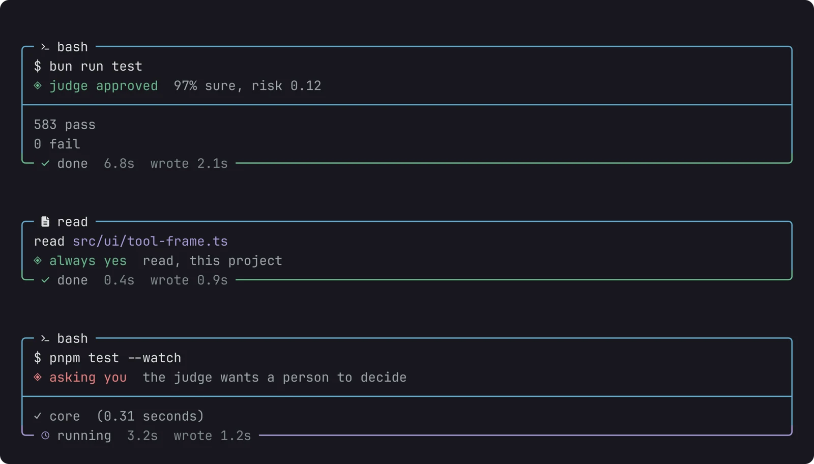
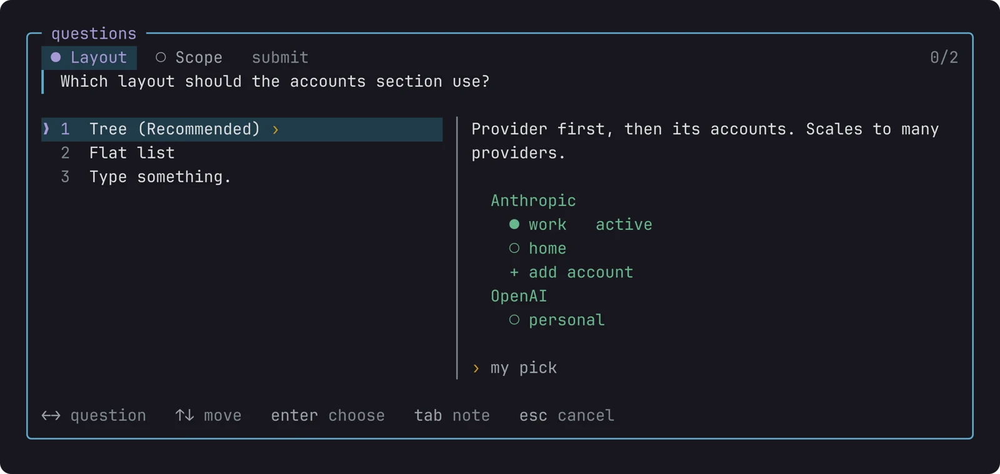

# agents

I use one AI agent, [Pi](https://pi.dev/), in the terminal. Pi comes small on purpose: a model, a few tools and an editor, and the rest you add with packages. Most of what I add is my own now, [pi-harness](https://github.com/felipeadeildo/pi-harness). The story of why is in [the post about it](../../log/posts/0001_yes_another_agent_harness.md).


/// caption
Pi when it starts, and a prompt halfway through its answer. The start card, the frame and the footer are my own harness, drawn by [the look](#look).
///

## Install

``` sh
curl -fsSL https://pi.dev/install.sh | sh
pi
```

The script installs Pi with the `npm` of whatever Node is active, here Node 24 from [fnm](../workbench/index.md#languages), and adds the `# Pi` line to my [`config.fish`](../workbench/index.md#what-i-added). Then `/login anthropic` connects my Claude subscription, and I stay on Claude Opus 5.5, medium effort.

## Settings

The ones I changed in `~/.pi/agent/settings.json`:

| Setting | Why |
| --- | --- |
| `outputPad`: 0 | code blocks get the full width |
| `steeringMode`: all | messages I send while it works arrive together, not one per step |
| `followUpMode`: all | same for follow-ups (++alt+enter++) |
| `showCacheMissNotices` | tells me when a turn costs more because the cache missed |
| `enableInstallTelemetry`: false | no install reports |
| `warnings.anthropicExtraUsage`: false | [providers](#providers) bills the subscription, so the warning is wrong |
| `defaultModel`: claude-opus-5-5 | where every session starts |

## Packages

`pi install npm:<name>` writes each line for you.

``` json title="~/.pi/agent/settings.json"
"packages": [
  "npm:@adeildo/pi-harness",
  "npm:pi-hide-providers",
  "npm:pi-web-access",
  "npm:pi-memory",
  "npm:pi-subagents"
]
```

## pi-harness

**I wrote this one.** Four pieces on top of Pi, no fork. ++alt+s++ opens the settings of all of them, and `pi config` turns any of them off.

### permission

Pi runs every tool call without asking. This makes it ask: `yes`, `always yes` or `no`, with a note the model reads. A no to `npm install` with "use pnpm instead" makes it switch to pnpm.


Reads never ask, and an edit shows its diff. ++alt+m++ switches between `manual`, `edits`, `judge` and `full`. I live in `judge`: a small model, Jev from typesafe.ai, reads every call that isn't a read or an edit, and I only see the ones it doubts. Each call says on its frame who let it through:



Mine runs on `relaxed` rigor (55% sure, risk up to 0.60) and gives up after 2 seconds, which sends the call to me. The policy is plain text:

``` md title="judge policy"
# May run without asking
- Reading, searching, and listing files
- Editing files inside the project
- Running tests, linters, type checks, builds, and formatters
- git status, diff, log, add, and commit

# Must always ask first
- sudo, or anything that changes state outside the project
- Installing or upgrading global packages
- Pushing, force operations, or rewriting history
- Downloading and running remote scripts
- Deleting files outside the project, or recursive deletes

# When in doubt
Ask me.
```

Calls outside the project go to the judge like any other, since I work across repos a lot.

### questions

When something could go two ways, the agent asks instead of guessing: options, a preview of each, and a row for my own answer. ++tab++ leaves a note on any option, picked or not. The permission dialog is this same dialog, with the same keys.



### look

Pi's screen, drawn around what matters while the agent works: the start card, a frame around every tool call, a stopwatch above the editor, the branch, the mode and the model on the editor's borders, and a footer with the cost and how much of the Claude plan is left. It replaced pi-open-tui, and nothing on it dances: every number has a fixed width.

### providers

Bills Pi's Claude requests to my Pro/Max plan instead of extra usage, by introducing Pi to Anthropic as Claude Code. It also keeps two accounts, mine and the work one (`ranqia`). ++alt+a++ switches between them, and when one hits a limit it offers to move to the other.

!!! warning "Read the fine print"

    Using your subscription from anything other than Claude Code may break Anthropic's terms. Decide if that's a risk you're fine with. A request with an API key goes out untouched.

## From other people

| Package | What it does for me |
| --- | --- |
| [pi-hide-providers](https://github.com/monotykamary/pi-hide-providers) | hides Amazon Bedrock from `/model`, which shows up because my shell exports a work `AWS_PROFILE` |
| [pi-web-access](https://github.com/nicobailon/pi-web-access) | search, pages, GitHub repos, PDFs and YouTube, with no API key |
| [pi-memory](https://github.com/jayzeng/pi-memory) | decisions, a daily log and a scratchpad in markdown, searched by meaning with [qmd](https://github.com/tobi/qmd). It's why I never repeat "commits are one line" |
| [pi-subagents](https://github.com/nicobailon/pi-subagents) | hands a task to a child session with a clean context and a cheaper model, only when I ask |

MCP needs no package anymore. Pi reads `.pi/mcp.json` in each trusted project since 0.99, and every MCP call goes through [permission](#permission).

## Skills

Installed with [skills](https://github.com/vercel-labs/skills): `npx skills add <repo>`.

| Skill | From | For |
| --- | --- | --- |
| `unslop` | [cursor/plugins](https://github.com/cursor/plugins) | text that doesn't sound like AI. This wiki went through it |
| `simplify` | [brianlovin/agent-config](https://github.com/brianlovin/agent-config) | cleaning up code that was just written |
| `code-review` | [mattpocock/skills](https://github.com/mattpocock/skills) | reviewing a branch against the repo's standards and the issue |
| `frontend-design` | [anthropics/skills](https://github.com/anthropics/skills) | interfaces with a real visual direction |
| `web-design-guidelines` | [vercel-labs/agent-skills](https://github.com/vercel-labs/agent-skills) | reviewing a UI for accessibility |
| `tui-design` | [hyperb1iss/hyperskills](https://github.com/hyperb1iss/hyperskills) | terminal interfaces. The look got a lot of it |
| `find-skills` | [vercel-labs/skills](https://github.com/vercel-labs/skills) | finding other skills |

## What's still missing

Everything here assumes one session, one terminal, and me in front of it. Next on the [roadmap](https://github.com/felipeadeildo/pi-harness/blob/main/ROADMAP.md):

- **Sessions that talk**, passing what one found to another.
- **My phone**, to follow a session and approve a call from anywhere, under the same policy, probably over [Tailscale](../workbench/index.md#command-line-tools).
- **My own memory and web access**, so pi-memory and pi-web-access share state with the rest of the harness.

*[MCP]: Model Context Protocol, a standard way to plug tools and data sources into an AI agent
