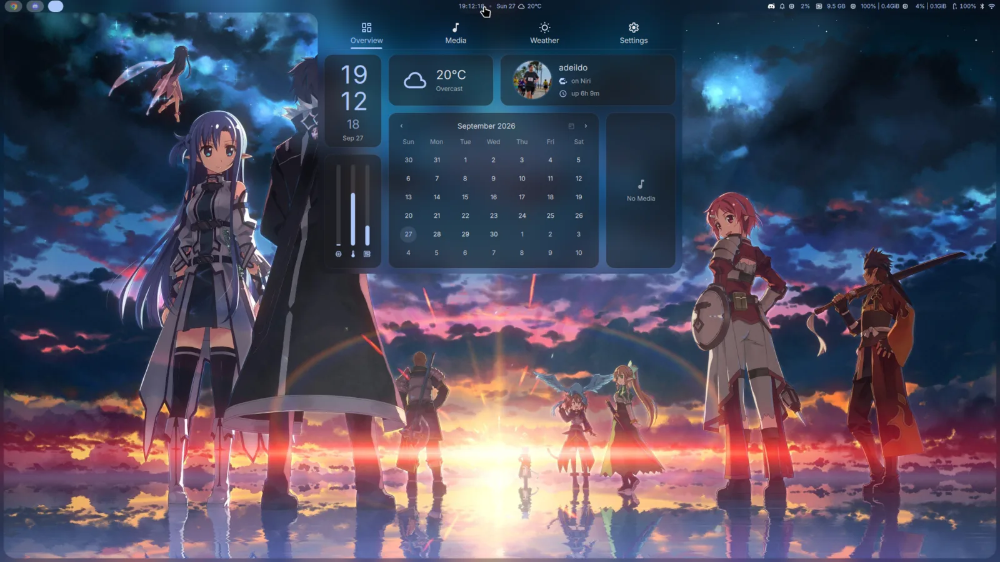
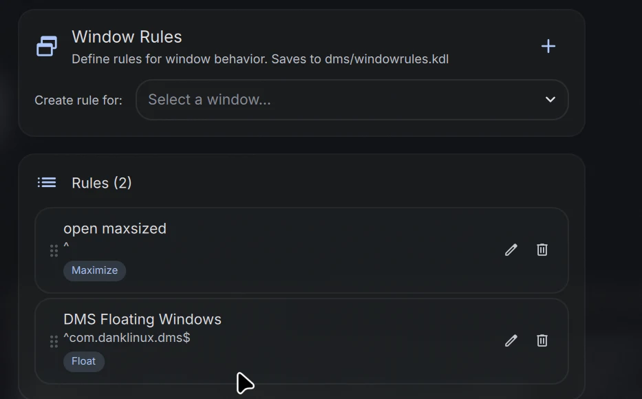
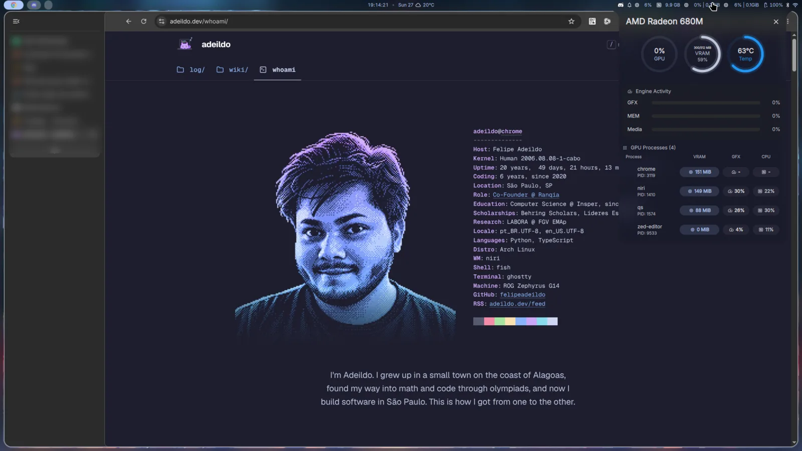
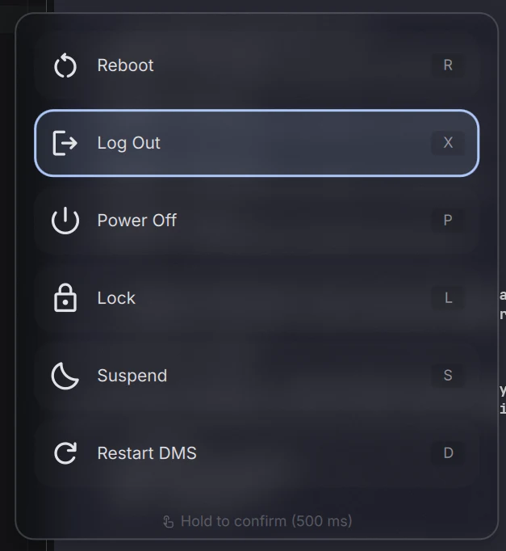
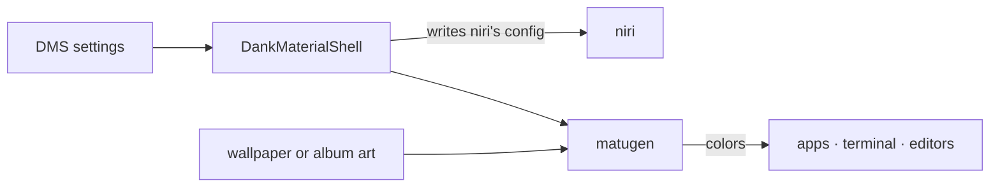
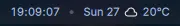
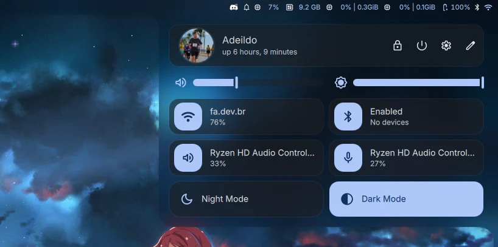
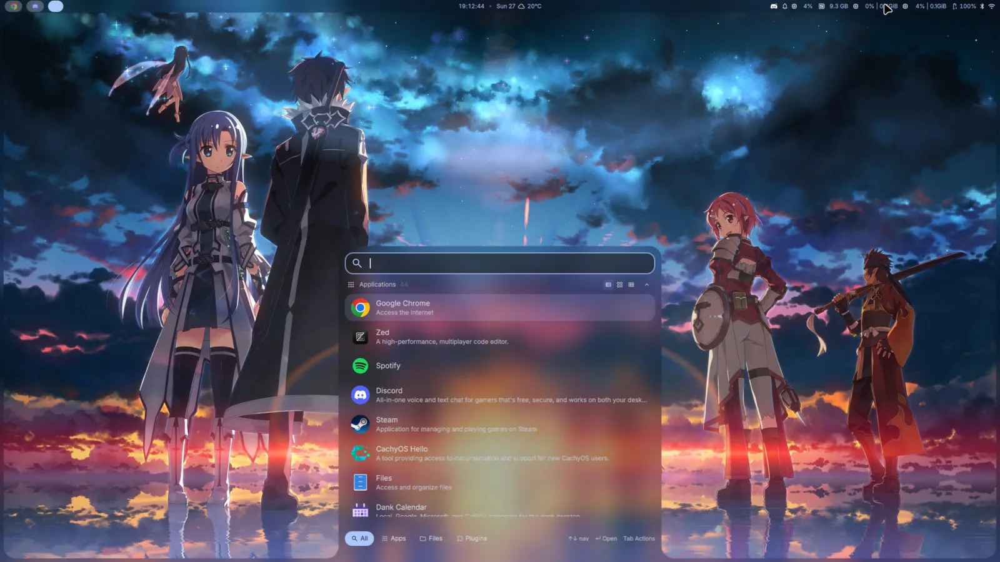

# desktop

This is what shows up when I open the laptop. Under it there's CachyOS, installed with no desktop at all. niri decides where windows go, and DankMaterialShell draws the rest: the bar, the launcher, notifications, the lock screen, the colors.


/// caption
Click the clock in the bar and you get this dashboard.
///

<div class="grid cards" markdown>

-   :lucide-cpu:{ .lg .middle } **CachyOS**

    ---

    Arch Linux, but with a faster kernel and packages built for recent CPUs. I installed it bare, no desktop.

    [:lucide-arrow-right: kernel, packages, games](#cachyos)

-   :lucide-columns-3:{ .lg .middle } **niri**

    ---

    Puts windows side by side on a strip you scroll through. It never squeezes them to make room.

    [:lucide-arrow-right: the strip, my changes, keys](#niri)

-   :lucide-panels-top-left:{ .lg .middle } **DankMaterialShell**

    ---

    Bar, launcher, notifications, lock screen and colors, all in one program you configure from a settings window.

    [:lucide-arrow-right: frame, colors, plugins](#dankmaterialshell)

</div>

All of this runs on an ASUS ROG Zephyrus G14 (GA402RJ), with a Ryzen 9 6900HS and two GPUs: a Radeon RX 6700S and the Radeon 680M that lives inside the CPU.

## Get the same desktop

Honestly, two steps get you about 90% of what you see here.

1.  **Install [CachyOS](https://cachyos.org/download/) and skip the desktop.** When the installer asks which desktop environment you want, don't pick any. You'll reboot into a plain text console.

2.  **Log in there and run the Dank Linux installer.**

    ``` sh
    curl -fsSL https://install.danklinux.com | sh
    ```

    It asks you two things, which compositor and which terminal. I went with niri and Ghostty. It then installs everything and writes a config that already works. Reboot, and you're looking at the DMS login screen.

That's it. The rest of this page is what I tweaked afterwards, and I did all of it from the DMS settings window. I never had to open a config file.

!!! tip "Want to read the script first?"

    Fair. Piping something from the internet into `sh` runs it sight unseen. This one is short: it downloads `dankinstall` from the [DankMaterialShell releases](https://github.com/AvengeMedia/DankMaterialShell/releases), checks it against its SHA-256 and runs it. Open [install.danklinux.com](https://install.danklinux.com) in a browser and you can read the whole thing.

## CachyOS

[CachyOS](https://cachyos.org/) is Arch Linux with some serious tuning. Underneath it's still Arch, so `pacman`, the AUR and the [Arch wiki](https://wiki.archlinux.org/) work the same as always.

!!! info "Why no desktop environment"

    The installer offers KDE, GNOME, Hyprland and a bunch more. I skipped all of them, since DMS replaces most of what they bring. Right now the system has 218 packages I installed on purpose, out of 1,368 in total.

What I get out of it, over plain Arch:

=== "A faster kernel"

    The default kernel, `linux-cachyos`, is the same Linux, compiled with a lot more care:

    - they build it with Clang and ThinLTO, which lets the compiler optimize across the whole kernel at once
    - they run it under real workloads, record what's hot (that's AutoFDO), and rebuild it using that recording
    - it ticks 1000 times per second, so the desktop reacts faster
    - it ships patches this laptop actually uses: newer AMD power management, ASUS hardware fixes, and variable refresh rate over HDMI

    I keep `linux-cachyos-lts` installed next to it. If an update ever breaks something, I pick the LTS kernel in the boot menu and move on.

=== "Packages for my CPU"

    Arch builds its packages for any x86-64 CPU, going back to 2003. CachyOS rebuilds them for x86-64-v3[^v3], which newer CPUs support, so the code can use instructions an old CPU wouldn't have. The installer checks your CPU and turns these repositories on by itself:

    ``` ini title="/etc/pacman.conf"
    [cachyos-v3] # (1)!
    Include = /etc/pacman.d/cachyos-v3-mirrorlist

    [cachyos-core-v3]
    Include = /etc/pacman.d/cachyos-v3-mirrorlist

    [cachyos-extra-v3]
    Include = /etc/pacman.d/cachyos-v3-mirrorlist

    [cachyos] # (2)!
    Include = /etc/pacman.d/cachyos-mirrorlist
    ```

    1. These sit above Arch's own `core` and `extra`, so when a package exists in both, `pacman` takes the v3 one.
    2. CachyOS's own tools, like the kernel manager and `chwd`. These work on any x86-64 CPU.

=== "Drivers and games"

    During the install, [`chwd`](https://wiki.cachyos.org/features/chwd/chwd/) looks at your hardware and installs the right drivers. Here it saw two AMD GPUs and set up the `amd` profile, so both worked on the very first boot. I didn't install a single driver myself.

    ``` console
    $ chwd --list-installed
    > Installed profiles:
      amd   priority 4
    ```

    For games there's `cachyos-gaming-meta`, which pulls in CachyOS's own builds of Proton and Wine plus the usual helpers. In practice I open Steam, hit play, and the game just runs.

## niri

[niri](https://github.com/YaLTeR/niri) is a Wayland compositor, the program that decides where each window goes. Most tiling compositors split your screen into smaller and smaller pieces as you open things. niri does the opposite. Windows sit side by side on a strip that keeps growing to the right, and you scroll along it. Opening a new window never shrinks the ones you already have.

<figure class="strip" aria-label="Diagram: three workspaces, each a row of maximized windows; the monitor shows one window of the top row and scrolls along it">
<div class="strip__stage" aria-hidden="true">
<div class="strip__row strip__row--active">
<span class="strip__label">1</span>
<div class="strip__track">
<div class="strip__window" style="--tint: var(--ctp-blue)"><b>chrome</b></div>
<div class="strip__window" style="--tint: var(--ctp-mauve)"><b>ghostty</b></div>
<div class="strip__window" style="--tint: var(--ctp-green)"><b>spotify</b></div>
<div class="strip__window" style="--tint: var(--ctp-lavender)"><b>discord</b></div>
</div>
</div>
<div class="strip__row">
<span class="strip__label">2</span>
<div class="strip__track">
<div class="strip__window" style="--tint: var(--ctp-sky)"><b>steam</b></div>
<div class="strip__window" style="--tint: var(--ctp-peach)"><b>ghostty</b></div>
</div>
</div>
<div class="strip__row">
<span class="strip__label">3</span>
<div class="strip__track">
<div class="strip__window" style="--tint: var(--ctp-yellow)"><b>nautilus</b></div>
</div>
</div>
<div class="strip__screen"><span>eDP-2</span></div>
</div>
<figcaption>The monitor stays put and the strip slides under it. Each row is a workspace, and <kbd>Super</kbd> + <kbd>U</kbd> or <kbd>Super</kbd> + <kbd>I</kbd> jumps down or up to the next one.</figcaption>
</figure>

Each monitor gets its own workspaces, stacked vertically. A window never spills over onto the monitor next to it.

### What I changed

Just two things, both from the DMS settings.

**Every window opens maximized.** Each app takes the whole width of the screen, and I flip through them like pages. It's a single window rule that matches every app (`^` matches any name). I made it in the window rules editor, which opens with ++super+shift+w++. The second rule in the list came with DMS and keeps its own windows floating.

{ width="560" }

Here's how that looks with Chrome open. The window fills the screen inside the frame. The panel on the right is the GPU monitor, opened from the bar.



**++super+return++ opens Ghostty.** The terminal is the window I open the most, so it gets the easiest key.

When I do want two things on screen at once, ++super+r++ makes the column a third, half or two thirds of the screen. ++super+bracket-left++ drops the window into the column on its left, one on top of the other.

### Keys

The ones I use all the time. ++super++ is the Windows key.

| Keys | What it does |
| --- | --- |
| ++super+space++ | launcher |
| ++super+return++ | terminal (Ghostty) |
| ++super+q++ | close the window |
| ++super+h++ ++super+l++ | previous and next column |
| ++super+j++ ++super+k++ | window below and above, in the same column |
| ++super+u++ ++super+i++ | workspace below and above |
| ++super+r++ | column width: 1/3, 1/2, 2/3 |
| ++super+f++ | maximize the column |
| ++super+w++ | show the column as tabs |
| ++super+o++ | overview of every workspace |
| ++super+v++ | clipboard history |
| ++super+n++ | notifications |
| ++super+m++ | task manager |
| ++super+comma++ | DMS settings |
| ++super+alt+l++ | lock the screen |
| ++super+x++ | power menu |

{ width="320" align="right" }

++super+x++ opens the power menu, and every option has its own letter: ++r++ reboots, ++p++ powers off, ++s++ suspends, ++l++ locks, ++x++ logs out. You hold the letter for half a second to confirm, so a stray key doesn't turn the laptop off.

There's also Restart DMS (++d++), which reloads the bar and everything else DMS draws, without closing any window. Good for when a plugin gets stuck.

## DankMaterialShell

[DankMaterialShell](https://github.com/AvengeMedia/DankMaterialShell), DMS for short, is made by AvengeMedia under the [Dank Linux](https://danklinux.com/) name. niri on its own only places windows. The bar, the launcher, notifications, the lock screen, all of that usually means installing and configuring a separate tool for each one: waybar, mako, swaylock, swayidle and friends. DMS is all of them in one program, with one settings window (++super+comma++). Even the login screen is DMS.



So I change something in the settings window, and DMS rewrites niri's config and every app's colors on its own.

### Frame mode

This one setting is most of why the desktop looks the way it does. Frame mode draws a thin border around the whole screen and melts the bar into it, so the bar stops looking like a strip glued to the top. You can see it around the full-screen screenshots on this page. I made mine thinner and almost see-through:

| Setting | Default | Mine |
| --- | --- | --- |
| frame | off | ==on== |
| thickness | 16 | 7 |
| opacity | 100% | 36% |
| bar size inside the frame | 40 | 24 |
| bar inset padding | auto | 9 |

### Colors

The theme is set to `dynamic`. DMS pulls the colors out of the wallpaper with [matugen](https://github.com/InioX/matugen) and paints everything with them: the shell, my apps, the terminal, the editors. Change the wallpaper and the whole system follows. I switched the palette style from Tonal Spot to Fidelity, which stays closer to the colors actually in the picture.

!!! tip "Colors from the music"

    The media player in DMS already picks an accent color from the album art of what's playing. My [Music Theme](#plugins) plugin takes that color and repaints the whole system with it.

### The bar

I don't use a dock. The bar up top is enough.

<div class="bar-parts" markdown="0">
<figure><figcaption><b>left</b>my workspaces, each one with the icons of what's open in it</figcaption></figure>
<figure><figcaption><b>center</b>the song playing, if there is one, the clock with seconds, and the weather</figcaption></figure>
<figure><figcaption><b>right</b>tray, notifications, CPU, memory, one monitor for each GPU, battery, and the control center</figcaption></figure>
</div>

The control center at the right end has Wi-Fi, Bluetooth, audio devices, brightness, night mode and dark mode.

{ width="560" }

### The launcher

++super+space++ opens it. Apps come first, sorted by how often I use them, and the tabs at the bottom switch to files or plugins.



It's also a calculator, always on. Type `77*34` and `2618` is already there, ++enter++ copies it. Other tools wake up with a short prefix:

| Prefix | Tool | Try |
| --- | --- | --- |
| `?` | search the settings | `? blur` |
| `cb` | clipboard history | `cb token` |
| `pw` | power menu | `pw reboot` |
| `qrg` | QR code generator | `qrg https://adeildo.dev` |

??? note "Every other setting I changed"

    | Setting | Default | Mine |
    | --- | --- | --- |
    | animations | fast | a bit slower, and slower still for popups |
    | blur | off | on |
    | floating windows | opaque | 34% opacity |
    | panels on top | opaque | 57% opacity |
    | bar shadow | on | off |
    | widget colors | default | colorful, on a flat background |
    | app icons on workspaces | hidden, grouped, up to 3 | shown, one per window, up to 5 |
    | tray icons | original colors | monochrome |
    | clock | follows the language | 24 hours, with seconds |
    | weather | manual location, km/h | automatic location, m/s |
    | dashboard | wallpaper tab shown | wallpaper tab hidden |
    | network | automatic | prefer Wi-Fi |
    | cursor | system default | Bibata Modern Classic, 24 px |
    | color picker | off | on |

### Plugins

DMS has a [plugin registry](https://plugins.danklinux.com/), and installing one is a click in the Plugins tab. These are the five I keep on. Three of them have code of mine in them.

<div class="grid cards" markdown>

-   :lucide-music:{ .lg .middle } **[Music Theme](https://github.com/felipeadeildo/dms-music-theme)**

    ---

    **I wrote this one.** It repaints the whole system with the colors of the album art that's playing, without touching the wallpaper. Stop the music and everything goes back to the wallpaper colors.

-   :lucide-gauge:{ .lg .middle } **[AMD GPU Monitor](https://github.com/navidagz/dms-amd-gpu-monitor)**

    ---

    By Navid A. **I added the automatic GPU discovery**, so it finds every GPU on its own. Usage, video memory, temperature, power and which processes are on the GPU, one widget per GPU. That's how my bar shows both.

-   :lucide-chart-line:{ .lg .middle } **[Claude Code Usage](https://github.com/titeya/dms-claudecode)**

    ---

    By Nicolas Bellamy, **with a good chunk of my code in it**. Shows my Claude Code limits in the bar, with tokens, estimated cost and daily activity when you click it. It also splits usage by profile from [claude-code-profiles](https://github.com/felipeadeildo/claude-code-profiles), another project of mine.

-   :lucide-calculator:{ .lg .middle } **[Calculator](https://github.com/rochacbruno/DankCalculator)**

    ---

    By Bruno Rocha. The math in the launcher. I turned on "always active", so it answers any valid expression without a prefix.

-   :lucide-container:{ .lg .middle } **[Docker Manager](https://github.com/LuckShiba/DmsDockerManager)**

    ---

    By LuckShiba. How many containers are running, right in the bar. Click it to start, stop or restart one, read its logs or open a shell inside it.

</div>

#### How Music Theme works

DMS already had every piece. They just weren't connected, so I connected them.

1. DMS already knows what's playing, and already picks an accent color from the album art for its media player.
2. The plugin waits 250 ms for that color to settle. Otherwise skipping through five songs would repaint the system five times.
3. It sends the color down the same path the wallpaper colors take. Everything DMS knows how to paint (GTK and Qt apps, terminals, Neovim, VS Code, Zen) follows the song.
4. When the music stops, or I turn the plugin off, the colors go back to the wallpaper.

No `playerctl`, no Python, nothing extra to install. It only uses what DMS already gives plugins.

[^v3]: x86-64-v3 covers the instructions that came with CPUs from around 2013 on, like AVX2 and FMA, which speed up a lot of number crunching. Every Ryzen has them, and so does every Intel CPU since Haswell. [Phoronix measured](https://www.phoronix.com/review/cachyos-x86-64-v3-v4) how much faster CachyOS gets with them.

*[AUR]: Arch User Repository, where people share build recipes for software that isn't in the official repos
*[ThinLTO]: a way to compile where the compiler looks at the whole program at once, instead of one file at a time
*[AutoFDO]: recording where the code spends its time on real workloads, then compiling again using that recording
*[LTS]: long-term support, a kernel version that gets fixes for years instead of weeks
*[DMS]: DankMaterialShell
*[GTK]: the toolkit GNOME apps are built with
*[Qt]: the toolkit KDE apps are built with
