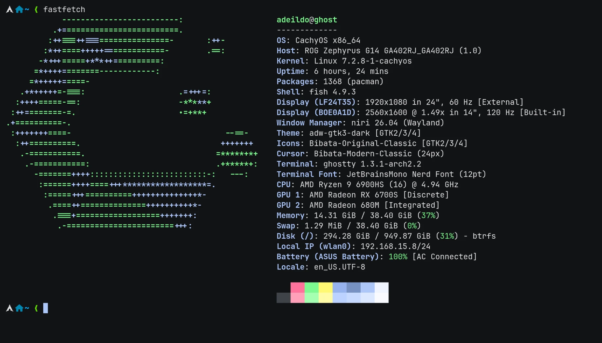

# workbench

Everything I open to get work done. fish in Ghostty, uv, bun and fnm for the languages, Zed to write code, and a handful of apps. Almost all of it installs with one `curl` or one `paru` line, and I keep forgetting which one, so they're all written down here.


/// caption
`fastfetch` on this machine.
///

## The machine

An ASUS ROG Zephyrus G14 from 2022, the GA402RJ.

| | |
| --- | --- |
| CPU | AMD Ryzen 9 6900HS, 8 cores, 16 threads, up to 4.9 GHz |
| GPU | Radeon RX 6700S, plus the Radeon 680M inside the CPU |
| Memory | 38.4 GiB, as the system sees it |
| Disk | 1 TB, btrfs |
| Screen | 14", 2560×1600 at 120 Hz, scaled 1.5× |
| Second screen | a 24" Samsung (LF24T35), 1920×1080 at 60 Hz |

CachyOS set up the drivers for both GPUs on its own, there's more on that in [desktop](../desktop/index.md#cachyos).

## The shell

The shell is [fish](https://fishshell.com/), version 4.9. It suggests commands from history as you type and knows the flags of most programs, with no setup.

### What CachyOS already sets up

CachyOS ships its own fish config, the `cachyos-fish-config` package, and my `config.fish` loads it on the first line. It brings:

- **a notification when a long command finishes.** Anything that takes more than 10 seconds pops a notification when it's done, through the [done](https://github.com/franciscolourenco/done) plugin.
- **`ls` with icons.** `ls`, `la`, `ll` and `lt` are all [eza](https://eza.rocks/), folders first.
- **man pages in color**, piped through [bat](https://github.com/sharkdp/bat).
- **`!!` and `!$` like in bash.** `sudo !!` reruns the last command with sudo.
- **a pile of aliases**, like `update` (picks the fastest mirrors, then updates), `cleanup` (removes orphan packages) and `jctl` (errors from this boot's log).
- **`fastfetch` every time a terminal opens.** I turned this one off.

### What I added

This is my whole `config.fish`:

``` fish title="~/.config/fish/config.fish"
source /usr/share/cachyos-fish-config/cachyos-config.fish

# overwrite greeting to disable fastfetch
function fish_greeting # (1)!
end

# bun
set --export BUN_INSTALL "$HOME/.bun" # (2)!
set --export PATH $BUN_INSTALL/bin $PATH

# aws
set --export AWS_PROFILE ranqia-prod # (3)!
set --export AWS_REGION us-east-1

# Added by jcode installer
if not contains "/home/adeildo/.local/bin" $PATH
    set -gx PATH "/home/adeildo/.local/bin" $PATH
end

# Pi
fish_add_path "/home/adeildo/.local/share/fnm/node-versions/v24.19.0/installation/bin" # (4)!
```

1. The CachyOS config defines `fish_greeting` to run `fastfetch`. Defining it again, empty, wins because it comes later. Terminals open straight to the prompt now.
2. The bun installer wrote these two lines.
3. The AWS profile and region I use for work, so the `aws` CLI and Terraform pick them up without flags.
4. Pi's installer wrote this one. It installs Pi with the `npm` from Node 24.19.0 and puts that folder on the `PATH`, so if I ever switch the default Node version, this line needs to change too.

Everything else fish loads comes from `conf.d/`. That's where installers leave their files: fnm's lives there, and so does the fish wrapper for [claude-code-profiles](https://github.com/felipeadeildo/claude-code-profiles).

### The prompt

The prompt is [Tide](https://github.com/IlanCosman/tide). I install it with [fisher](https://github.com/jorgebucaran/fisher), which is in the Arch repos, and then run the setup wizard:

``` sh
sudo pacman -S fisher
fisher install ilancosman/tide@v6
tide configure
```

The wizard shows real previews and you pick with the keyboard. Mine ended up on one line, with no frame:

- **left side**, the Arch icon, the folder I'm in and the git branch, with counts for staged, changed and untracked files.
- **right side**, things that only show up when they matter. The exit code of a command that failed, how long a slow command took, the Python virtualenv, the Node version inside a Node project, and the AWS profile.

## Languages

Each language gets its own manager, installed from its own script and not from `pacman`. They live in my home folder and don't get in the way of the system packages.

=== ":simple-python: Python, with uv"

    [uv](https://docs.astral.sh/uv/) manages Python versions, virtualenvs and packages, all in one tool.

    ``` sh
    curl -LsSf https://astral.sh/uv/install.sh | sh
    ```

    It lands in `~/.local/bin`, which is already on the `PATH`. When I need a new package in a project, it's always `uv add`, never a hand edit to `pyproject.toml`, so the lockfile stays in sync.

=== ":simple-bun: JavaScript, with bun"

    [bun](https://bun.sh/) runs JavaScript and TypeScript, installs packages and runs scripts, and it's fast at all of it.

    ``` sh
    curl -fsSL https://bun.sh/install | bash
    ```

    It installs into `~/.bun`, adds two lines to `config.fish` (the ones marked above) and drops its completions in `~/.config/fish/completions/`. The global packages I install with `bun add -g` are mostly agent tools, they get their own page in [agents](../agents/index.md).

=== ":simple-nodedotjs: Node, with fnm"

    This is the one I always forget the name of. It's [fnm](https://github.com/Schniz/fnm), Fast Node Manager. It does the same job as nvm, reads the same `.nvmrc` and `.node-version` files, but it's a single Rust binary and it works in fish without any adapter.

    ``` sh
    curl -fsSL https://fnm.vercel.app/install | bash
    ```

    The script installs into `~/.local/share/fnm` and, when your shell is fish, writes `~/.config/fish/conf.d/fnm.fish`. Then:

    ``` sh
    fnm install 24
    fnm default 24
    ```

    My default is Node 24.19.0.

    !!! note "It doesn't switch versions by itself"

        The installer sets fnm up without `--use-on-cd`, so walking into a project with a `.nvmrc` doesn't change the Node version. `fnm use` inside the folder does it by hand. To make it automatic, change the line in `conf.d/fnm.fish` to:

        ``` fish
        fnm env --use-on-cd --shell fish | source
        ```

## Editor

I write code and open files in [Zed](https://zed.dev/).

``` sh
curl -f https://zed.dev/install.sh | sh
```

That puts the app in `~/.local/zed.app` and the `zed` command in `~/.local/bin`. It updates itself. `zed .` opens the current folder.

The settings file is the one thing I copy to every new machine. Here's what each part does, grouped:

=== "Python and TypeScript"

    ``` json title="settings.json"
    "languages": {
      "Python": {
        "tab_size": 4,
        "format_on_save": "on",
        "language_servers": ["ty", "ruff"] // (1)!
      },
      "TypeScript": {
        "tab_size": 2,
        "format_on_save": "on",
        "inlay_hints": { "enabled": false } // (2)!
      },
      "TSX": { "inlay_hints": { "enabled": false } }
    }
    ```

    1. By default Zed runs basedpyright and ruff on Python, and keeps [ty](https://docs.astral.sh/ty/) turned off. This list replaces the default completely. ty checks the types, ruff lints and formats, and basedpyright never starts. Both come from Astral, the same people behind uv.
    2. The inline type hints are on everywhere else, but not in TypeScript.

    Saving a Python file runs ruff's formatter and sorts the imports. That second part is Zed's default for Python, I didn't have to add it.

=== "Look"

    | Setting | What it does |
    | --- | --- |
    | `theme`: DankShell Dark Transparent | the theme DMS writes with the wallpaper colors, so Zed changes along with everything else |
    | `icon_theme`: Material Icon Theme | the file icons from VS Code's Material theme |
    | `buffer_font_family`: JetBrainsMono Nerd Font Mono | JetBrains Mono, with the Nerd Font icons |
    | `buffer_font_weight`: 350 | a bit thinner than the regular 400 |
    | `buffer_font_features`: `calt`, `liga` | ligatures, so `=>` and `!=` render as one symbol |
    | `ui_font_size`: 17 | menus and panels one point bigger than the default |
    | `colorize_brackets` | rainbow brackets, each nesting level gets a color |
    | `indent_guides.coloring`: indent_aware | the indent lines are colored by depth too |
    | `show_whitespaces`: trailing | dots only for spaces left at the end of a line |
    | `unnecessary_code_fade`: 0.4 | unused imports and variables fade a bit more |
    | `gutter.folds`: false | no fold arrows next to the line numbers |
    | `gutter.min_line_number_digits`: 0 | the gutter is only as wide as the line numbers need |
    | `gutter.git_gutter_width`: 5 px | the git change bars have a fixed width |
    | `soft_wrap`: editor_width | long lines wrap at the edge of the window |
    | `show_wrap_guides`: false | no vertical ruler at 80 columns |

=== "Layout"

    | Setting | What it does |
    | --- | --- |
    | `project_panel.dock`: left | the file tree on the left, like VS Code |
    | `git_panel`, `outline_panel`, `collaboration_panel`: left | every panel on the left too |
    | `terminal.dock`: right | the terminal opens on the right, next to the code |
    | `bottom_dock_layout`: left_aligned | the bottom dock starts at the left edge of the window |
    | `project_panel.hide_root` | no root folder row at the top of the tree |
    | `project_panel.indent_size`: 13 | a tighter tree, 13 px per level |
    | `project_panel.entry_spacing`: standard | less space between the files in the tree |
    | `active_pane_modifiers.inactive_opacity`: 0.7 | splits I'm not typing in are dimmed |
    | `title_bar.button_layout`: "" | no minimize, maximize and close buttons, niri doesn't need them |
    | `title_bar.show_branch_status_icon` | the branch icon in the title bar shows the git status |
    | `status_bar.show_active_file` | the name of the open file at the bottom |
    | `tab_bar.show_nav_history_buttons`: false | no back and forward arrows in the tab bar |
    | `search.button`, `debugger.button`: false | two fewer buttons in the status bar |
    | `tabs.file_icons`, `tabs.git_status` | tabs get the file icon and turn yellow or green when the file changed |
    | `tabs.show_diagnostics`: errors | tabs mark files that have errors |
    | `file_finder.modal_max_width`: medium | a wider file finder, so long paths fit |

=== "Behavior"

    | Setting | What it does |
    | --- | --- |
    | `base_keymap`: VSCode | VS Code shortcuts, the ones my hands already know |
    | `autosave`: on_focus_change | a file saves when I switch to another tab or panel |
    | `use_smartcase_search` | search ignores case, until I type a capital letter |
    | `scroll_sensitivity`: 2 | scrolls twice as far per wheel step |
    | `autoscroll_on_clicks` | clicking near the edge of the editor scrolls it |
    | `hide_mouse`: never | the mouse stays visible while I type |
    | `inlay_hints.enabled` | inline type and parameter hints, off by default |
    | `diagnostics.inline.enabled` | errors show at the end of the line, not only on hover |
    | `git.inline_blame.padding`: 1 | the blame text sits right after the code |
    | `default_open_behavior`, `cli_default_open_behavior`: new_window | each project opens in its own window, and with niri that means its own column |
    | `session.trust_all_worktrees` | skips the "do you trust this folder?" question. Project settings and language servers start on their own, so only turn it on if you only open code you trust |

=== "Off"

    | Setting | What it does |
    | --- | --- |
    | `disable_ai` | turns off every AI feature in Zed. The agent panel, the inline assistant and edit predictions are all gone |
    | `edit_predictions.provider`: none | no autocomplete suggestions from a model |
    | `telemetry.diagnostics`, `telemetry.metrics`: false | no crash reports and no usage data sent to Zed |

    The file still has an `agent` section with models and a Claude Code server, from before I turned AI off. With `disable_ai` on, none of it runs. My AI work happens in the terminal, see [agents](../agents/index.md).

??? example "The whole settings.json"

    [:lucide-download: download it](zed-settings.json){ download="settings.json" } and drop it in `~/.config/zed/settings.json`.

    ``` json
    --8<-- "docs/wiki/workbench/zed-settings.json"
    ```

### Extensions

Zed already understands the big languages by itself. Extensions fill in the rest, and I install them from the extensions page (++ctrl+shift+x++).

| Extension | What it adds |
| --- | --- |
| [Material Icon Theme](https://github.com/zed-extensions/material-icon-theme) | the file icons |
| [oxc](https://github.com/oxc-project/oxc-zed) | Oxlint and Oxfmt, a linter and a formatter for JavaScript and TypeScript, written in Rust |
| [Comment](https://github.com/thedadams/zed-comment) | highlights `TODO`, `FIXME`, `NOTE` and friends inside comments |
| [Git Firefly](https://github.com/d1y/git_firefly) | colors for `.gitignore`, `.gitattributes`, git config and the interactive rebase file |
| [Dockerfile](https://github.com/zed-extensions/dockerfile) | Dockerfile and Docker Compose |
| [Terraform](https://github.com/zed-extensions/terraform) | Terraform and HCL |
| [Prisma](https://github.com/zed-extensions/prisma) | Prisma schemas |
| [SQL](https://github.com/zed-extensions/sql) | SQL highlighting |
| [TOML](https://github.com/zed-extensions/toml) | TOML, for `pyproject.toml` and friends |
| [Make](https://github.com/caius/zed-make) | Makefiles |
| [HTML](https://github.com/zed-industries/zed/tree/main/extensions/html) | HTML |
| [Emmet](https://github.com/zed-extensions/emmet) | Emmet abbreviations, `ul>li*3` then ++tab++ |
| [QML](https://github.com/lkroll/zed-qml) | QML, the language DMS and its plugins are written in |

## Apps

<div class="grid cards" markdown>

-   :simple-googlechrome:{ .lg .middle } **Google Chrome**

    ---

    The regular, stable Chrome. It's in the AUR as `google-chrome`.

-   :simple-ghostty:{ .lg .middle } **Ghostty**

    ---

    The terminal, opened with ++super+return++. It came with the DMS installer, and its theme is `dankcolors`, which DMS generates from the wallpaper. Font is JetBrains Mono Nerd Font at 12.

-   :lucide-folder:{ .lg .middle } **Nautilus**

    ---

    GNOME's file manager. Plain, and it looks great with the DMS colors. It's also what opens when an app asks me to pick a file, see [desktop](../desktop/index.md#what-niri-needs-around-it).

-   :simple-discord:{ .lg .middle } **Discord**

    ---

    Straight from the Arch repos.

-   :simple-spotify:{ .lg .middle } **Spotify**

    ---

    From the AUR. What's playing is also what paints the system, with [Music Theme](../desktop/index.md#plugins).

-   :simple-steam:{ .lg .middle } **Steam**

    ---

    From the Arch repos. `cachyos-gaming-meta` adds CachyOS's own Proton and Wine next to it.

</div>

All of them in one go:

``` sh
paru -S google-chrome spotify discord nautilus steam
```

[paru](https://github.com/Morganamilo/paru) comes with CachyOS. It works like `pacman`, but it also builds packages from the AUR, which is where Chrome and Spotify live.

## Command-line tools

The rest of what I installed by hand, straight from `paru`:

| Package | What for |
| --- | --- |
| `github-cli` | `gh`, for pull requests from the terminal. It's also git's login for GitHub |
| `docker` `docker-compose` `docker-buildx` | containers. My user is in the `docker` group, so no `sudo` |
| `aws-cli-v2` `terraform` `sops` `jq` | work infrastructure. `sops` keeps secrets encrypted inside the repo |
| `tailscale` | the Tailscale VPN |
| `amdgpu_top` | what each GPU is doing, per process |
| `dua-cli` | finds what's eating the disk, `dua i` for the interactive view |
| `ttf-jetbrains-mono-nerd` | the font in the terminal and in Zed |

``` sh
paru -S github-cli docker docker-compose docker-buildx aws-cli-v2 terraform sops jq tailscale amdgpu_top dua-cli ttf-jetbrains-mono-nerd
```

The AI tools, starting with [Pi](https://pi.dev/), get their own page: [agents](../agents/index.md).

*[AUR]: Arch User Repository, where people share build recipes for software that isn't in the official repos
*[DMS]: DankMaterialShell
